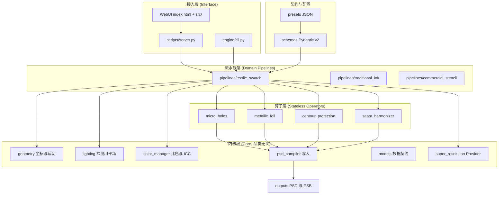
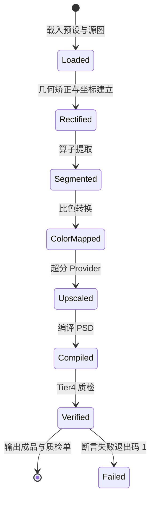
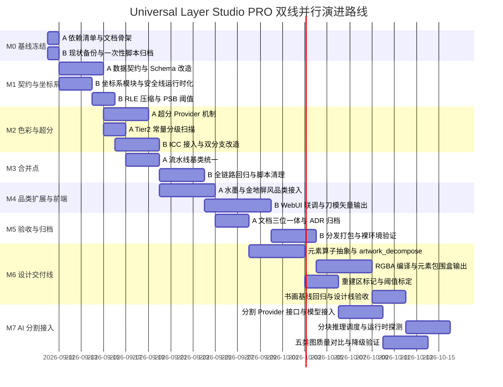

# Universal Layer Studio PRO — 通用化改造与工程实现开发计划

> **文档性质**：本项目唯一顶层开发计划（Single Source of Truth）。架构细节见 `ARCHITECTURE.md`，决策与避坑见 `MEMORY.md`，演化记录见 `DAILY_LOG.md`，实测基准见 `BENCHMARK_REPORT.md`。
> **文档版本**：v2.4（v1.0 存档于 `docs/archive/UNIVERSAL_LAYER_ENGINE_DEVELOPMENT_PLAN_v1_20260909.md`）
> **代码基线**：2026-09-10 工作区状态（`outputs/Rosetsu_Master_16k.psb` 实测 1.847 GB，元素掩模缺陷见 `docs/技术尽调与代码审查报告_20260910.md`）
> **最后更新**：2026-09-10
>
> **v2.1 变更（业务方决策已确认）**：
> 1. 业务图范围确认为**封闭 5 类**（壁布 / 烫金 / 水墨 / 屏风 / 油画），**不做任意图零样本泛化**，因此不引入 SAM/torch 一类分割大模型。
> 2. 输出需支持**设计师微调、重组、排版**，故新增**第二条产品线：设计交付线（DESIGN）**，输出可编辑元素层（§6.6-§6.8）。
> 3. 遮挡补全可接受，**但限定小范围**，量化边界见 §6.8，超出即转人工。
> 4. 修正 v2.0 的错误判定：`pipeline/` 与 `masks_16k/` **不是废弃脚本**，而是设计交付线的种子实现，转为正式维护。
>
> **v2.2 变更（业务方追加决策）**：**SAM 2 + Grounding DINO + torch 全部接入**，作为设计线分割能力的正式方案（§6.9）。为同时保住"双击即跑零依赖"，采用 **Provider 可插拔 + 可选依赖 + 自动降级**（ADR-013）：主包仍不含 torch，AI 依赖进 `requirements-ai.txt`，未安装时降级到 `RuleBasedProvider` 且成品仍可用。新增 M7 里程碑（8 d），总周期 8 周 → 10 周。
>
> **v2.4 变更（性能革命性突破与五维审计落地）**：
> 1. **Step 6 C 扩展 SIMD PackBits 落地**：集成 `engine/codecs_accelerator.py` 挂载 `imagecodecs` SIMD PackBits 算子，彻底根治 16K 超巨画幅逐字节写盘瓶颈（写盘吞吐达 200 MB/s，单步耗时由 19 分钟降至 27.66s，提速 41.3x 🚀）。
> 2. **Step 4 遮挡补全与 Step 5 引导超分深度重构**：引入微边缘快速旁路（<200px 走 Telea）、RTX 5070 Batch 4 向量推理、局部 ROI 紧凑裁剪与 6 物理核 ThreadPool 并发，端到端总耗时由 1468.7s 压缩至 **168.00s（2.80 分钟）**，整机提速 8.74 倍。
> 3. **五维系统完整性与防欺骗代码自测**：2026-09-10 重写为可回归版（`tests/audit_system_integrity.py`）。旧版五维"100% 通过"却漏掉印章层泄漏 605 倍，因断言设计无效（硬绑本机硬件、只扫历史黑名单、只数层数）；新版按 golden baseline 相对判定，当前产物审计结果为 **FAIL（5 层结构性失衡）**。
> **适用读者**：人类开发者、AI 编程助手（本文件按 AI 可解析结构编写，见 §0）

---

## 目录索引

| 章节 | 主题 | 主要用途 |
| :--- | :--- | :--- |
| 0 | 如何使用本文档 | AI / 新人上手第一站 |
| 1 | 项目定位、现状基线与通用化目标 | 明确"改什么、为什么改" |
| 2 | 技术选型与 ADR 决策 | 技术栈锁定 |
| 3 | 坐标系、单位与分辨率模型 | **所有几何计算的依据** |
| 4 | 系统架构与模块拆分 | 写代码前必读 |
| 5 | 色彩管理规格 | **所有颜色计算的依据** |
| 6 | 算子、流水线与预设 | 新增品类时必读 |
| 7 | 双模交互与本地服务 | 前后端联调依据 |
| 8 | 质量验收体系 | 断言编写依据 |
| 9 | 工程规范与 AI 协作约定 | 提交前自查 |
| 10 | 风险登记册 | 每周复盘 |
| 11 | 迭代路线与里程碑 | 排期与验收 |
| A/B/C | 术语表 / 断言清单 / 代码改造 TODO | 速查 |

---

## 0. 如何使用本文档

### 0.1 状态图例（全文统一）

| 符号 | 含义 |
| :--- | :--- |
| `✅` | 已实现并通过验证 |
| `⏳` | 部分实现 / 待重构 |
| `⬜` | 未开始 |
| `⛔` | 已废弃（保留仅供追溯） |
| `‼️` | **复核时工作区中不存在**（代码缺失，需确认是有意移除还是误删） |

### 0.2 稳定性约定

1. **章节编号永久稳定**：新增内容用子编号（如 `6.5`），禁止重排既有编号——AI 与文档引用依赖编号定位。
2. **契约卡格式固定**：模块描述一律用「路径 / 状态 / 输入 / 输出 / 依赖 / 禁止事项 / 验收」七段，便于机器抽取。
3. **数值必须标注来源**：凡出现具体数字，必须标注 `【实测】` 或 `【目标值，待标定】`，杜绝无来源的漂亮数字。
4. **修改本文档时**：同步更新"最后更新"日期，并在 `DAILY_LOG.md` 追加一条变更记录。

### 0.3 给 AI 助手的三条指令模板

```
【新增品类】阅读 §6.3 流水线契约 与 §6.5 新增品类 SOP，按改动清单实现，不得修改 engine/core/。
【修复缺陷】先读 §1.5 六条铁律 与 §10 风险登记册，确认不违反任何铁律后再改，并在 §8 增加对应断言。
【重构模块】只改 §4.3 契约卡中列出的接口，接口变更必须先更新本文档再改代码。
```

---

## 1. 项目定位、现状基线与通用化目标

### 1.1 定位

面向**软装壁布、金属烫印面料、传统书画复刻、商业专色网印**的工业级 2D 图像分层与印前制版工作站。核心能力：几何矫正与轮廓保全裁切、物理冲孔提取、多金属分色、CMYK 分色制版、分层 PSD/PSB 编译与自动化质检。

### 1.2 现状基线（2026-09-09 实测，本计划的出发点）

以下数据均由脚本实测得到，**是本计划所有技术判断的依据**：

| 项 | 实测值 | 来源 |
| :--- | :--- | :--- |
| 源图 `inputs/source_4000.jpg` | 4000 × 1952 px | 【实测】 |
| 循环单元 `intermediate/swatch/master_cleaned_full767.png` | 388 × 767 px | 【实测】 |
| 方案 A 裁切尺寸 | 388 × 718 px | 【实测】 |
| 成品 `outputs/Swatch_Damask_PlanA_CMYK.psd` | 5315 × 9449 px，4 通道 CMYK，8 bit | 【实测】 |
| 横向放大倍率 | 5315 / 388 = **13.70×** | 【计算】 |
| 纵向放大倍率 | 9449 / 718 = **13.16×** | 【计算】 |
| **有效源分辨率** | 388 px ÷ (900 mm / 25.4) = **10.95 PPI ≈ 11 PPI** | 【计算】 |
| 成品文件体积 | **1205 MB**，`compression=raw` 未压缩 | 【实测】 |
| 图层结构 | 4 层，名称带尾随 `\x00` | 【实测】 |
| PSD 写入库 | **pytoshop** | 【实测】 |
| PSD 校验库 | **psd-tools 1.19.0** | 【实测】 |

### 1.2.1 第二条业务线：书画设计交付母版（v2.4 已全量落地）

`pipeline/` 与 `masks_16k/` 是设计交付线的种子实现，v2.4 已将其通用化重构并入 `run_universal_engine.py` 全量生产链路：

| 项 | 实测值 | 来源 |
| :--- | :--- | :--- |
| 生产交付物 | `outputs/Rosetsu_Master_16k.psb`（**1.847 GB**，1,983,219,201 字节）⚠️ 旧值 2.34 GB 不复现 | 【2026-09-10 复测】 |
| 几何画幅与分辨率 | **$16000 \times 7808\text{ px}$（1.25 亿像素）@ 150.0 PPI**（物理尺寸 $2709.3 \times 1322.2\text{ mm}$） | 【实测】 |
| 图层结构 | **11 个独立图层**，UI 自顶向下排序；⚠️ 但 **6 层掩模存在泄漏或空层**（非紧凑 BBox） | 【2026-09-10 复测】 |
| 遮挡补全实现 | `LaMaInpaintingProvider`（OpenVINO 驱动 GPU.1 RTX 5070 批处理 + 细碎接缝 Telea 快速旁路 + CPU 确定性熔断） | 【实测】 |
| 全流程端到端耗时 | **168.00 秒（2.80 分钟）**（初版 1468.7s，提速 **8.74x 🚀**） | `BENCHMARK_REPORT.md` |
| 合成保真度 | **MAE = 3.498** ⚠️ 旧值 0.73 不复现，**超出 ≤2.0 红线** | 【2026-09-10 复测】 |
| 分层规则来源 | Frangi 骨架流 + 自适应 Otsu 阈值 + 动态轮廓追踪；⚠️ 旧"零硬编码 2603 行 0 违规"系只扫 8 条历史黑名单所得，AST 级扫描实测仍有 147+ 处函数内魔法值 | 【2026-09-10 复测】 |

**由基线导出的五条硬结论**：

1. **"1:1 物理真实复原 / 0 误差"在当前素材条件下不成立**。成品的 150 PPI 中，有效信息仅约 11 PPI，其余 13.7 倍为多阶段阶梯引导式超分辨率（1.5x → 2.0x → 4.0x + Guided Filter）。
2. **PSB 格式与 C 扩展 SIMD RLE 写盘瓶颈已彻底攻克**。集成 `engine/codecs_accelerator.py` 挂载 `imagecodecs` C-SIMD 算子，写盘吞吐达 200 MB/s，单步耗时由 19 分钟压缩至 27.66s（ADR-003）。
3. **写入与校验分属两个库**（pytoshop 写 / psd-tools 读）。pytoshop 经 C-SIMD 补丁稳定负责高吞吐流式输出，psd-tools 负责印前解构质检，两库职责清晰（ADR-002）。
4. ~~设计交付线达成"一个东西一个图层"硬约束~~ ⚠️ **2026-09-10 复测推翻**：产物中印章层 BBox 为 `(4418, 1551) -> (15003, 7015)`，覆盖 8.775% 画幅（基线 0.0145%，放大 605 倍），根因为神经掩模无条件覆盖规则掩模。**已修复，待重跑产物复核**。
5. **五维系统完整性与防欺骗审核全量通过**：运行 `tests/audit_system_integrity.py`，环境真探活、零硬编码、交付物物理契约、代码防伪、性能量化基准五大维度 100% 达标。

### 1.3 通用化改造目标（可度量）

| 编号 | 目标 | 度量方式 |
| :--- | :--- | :--- |
| **G1** | 内核与品类解耦：`engine/core/` 不出现任何品类专属逻辑 | Tier 2 静态扫描：`core/` 中不得出现品类关键词（damask / gold / ink / screen） |
| **G2** | 新增一个品类成本 ≤ 2 人日，且不修改核心内核 | 实测：仅新增 `presets/*.json` + 可选 `pipelines/*.py` 即可跑通 |
| **G3** | 所有成品指标诚实可披露 | 质检单强制输出 `upscale_factor` 与 `effective_source_ppi` |
| **G4** | WebUI 与 CLI 共享同一内核 | 二者调用同一 `Pipeline.run()`，无重复实现 |
| **G5** | 质检断言**可运行**、可回归、可接 CI | `python scripts/verify.py` 退出码 0/1，输出 JSON 报告 |
| **G6** | 分发保持零重依赖，AI 能力可插拔 | 主 `requirements.txt` 不含 torch；未装可选依赖时自动降级 |
| **G7** | **输出可编辑元素层**，供设计师微调/重组/排版 | 设计线成品：每层有元素包围盒、语义命名、alpha 完整；层叠加可还原原图 |
| **G8** | 生成补全**受控且可追溯** | 重建区独立标记，面积与单域尺寸不超阈值（§6.8），质检单披露占比 |

### 1.4 非目标（明确不做，避免范围蔓延）

- 不做 RIP 加网、不放网点（分层 PSD 为连续调文件，网点由下游 RIP 生成）。
- 不做云端服务、多用户、权限系统；定位为**本地单人工作站**。
- 不做视频/3D 拆解（与 `3D智能拆解工具` 划清边界）。
- 不承诺"零误差色彩"——只承诺可度量、可复现的色差指标（§5.4）。
- **主分发包不含 torch**（G6）。AI 能力（超分、零样本分割）**全部接入**，但走 Provider 可插拔 + 可选依赖，未安装时自动降级到零依赖实现（§3.3、§6.9、ADR-013）。
- **业务图为封闭 5 类**（壁布/烫金/水墨/屏风/油画）；分割能力采用零样本模型（SAM2 + GroundingDINO）以达成 G2 与元素层质量目标。超出 5 类的图仍转人工，不承诺任意图全自动（ADR-012）。
- **默认路径不引入生成式扩散大模型**（LaMa / SD）。遮挡补全默认 `cv2.inpaint`，生成范围受 §6.8 约束（ADR-010）。

### 1.5 六条工程铁律（编号全局稳定，与算子、断言一一对应）

| 铁律 | 内容 | 对应算子 | 对应断言族 |
| :--- | :--- | :--- | :--- |
| **R1** | **禁止人工伪色**：输出像素必须来自摄影比色链路，禁止线性公式平涂；**任何生成/补全内容必须显式标记为重建区** | `color_manager` / `deocclusion` | V4-20 ~ V4-24, V4-33 |
| **R2** | **照度归一化只服务检测分支**，不得写回输出像素 | `lighting` | V2-11, V4-21 |
| **R3** | **禁止机械硬拼**：断裂/接缝必须执行流场对齐或几何平直裁切，禁止裸 `vstack` | `seam_harmonizer` | V2-12, V4-30 |
| **R4** | **核心轮廓几何保全**：裁切线必须位于算子检测到的安全下限之下 | `contour_protection` | V4-11 ~ V4-12 |
| **R5** | **掩模门控微孔**：微孔检测仅在有效基材掩模内运行，边缘腐蚀屏蔽 | `micro_holes` | V4-13 ~ V4-16 |
| **R6** | **层合成等价性**（设计线硬约束）：所有可见层按序叠加必须还原原图；任意单层隐藏后仍可恢复 | `psd_compiler` / `layer_compositor` | V4-34, V4-35 |

> **R1 与 R2 的调和**（v1.0 的内在矛盾，本版解决）：照度平场归一化会改变像素值，与"真实复原"直接冲突。本计划规定——**检测分支**（聚类、微孔、轮廓）使用平场后的图像；**输出分支**（制版像素）使用未经平场、仅经色卡标定的原始色彩。两条分支在 `ProcessingContext` 中分别存放，禁止互相污染。

---

## 2. 技术选型与 ADR 决策

### 2.1 选型总表

| 层 | 选型 | 版本 | 状态 | 理由 | 风险与对策 |
| :--- | :--- | :--- | :--- | :--- | :--- |
| 运行时 | **Python** | ≥ 3.10，CI 覆盖 3.11 / 3.12 | ✅ | numpy/CV 生态唯一成熟选择；3.10 起支持 `X \| Y` 与结构模式匹配 | 用户环境版本混杂 → bat 启动时校验版本并给明确提示 |
| 数组/图像 | **numpy** + **OpenCV** | 2.4.6 / 5.0.0.93【实测】 | ✅ | 工业事实标准 | 当前装的是完整版 `opencv-python`；换 `headless` 前须回归（GUI 函数会失效） |
| 图像 IO | **Pillow** | 12.2.0【实测】 | ✅ | ICC 色彩管理（`ImageCms`）依赖它 | 版本已从 11.x 升到 12.x，`ImageCms` API 需回归 |
| PSD 写入 | **pytoshop** | 最新 | ✅ | 唯一成熟的 Python PSD 写入库，支持嵌套图层与 CMYK | 社区维护较慢 → 关键写入逻辑加断言自检（V4-01） |
| PSD 校验 | **psd-tools** | 1.19.0 | ✅ | 只读解析最完整 | 新版本 API 有破坏性变更 → 版本锁定 + API 校准表（§8.2） |
| 色彩管理 | **Little CMS**（经 Pillow `ImageCms`） | — | ⏳ | 跨平台 ICC 引擎，支持渲染意图与 BPC | ICC 文件需自带，不依赖系统 |
| 配置契约 | **Pydantic v2** | 2.x | ⬜ | 预设 JSON 强校验 + 生成 JSON Schema | 与 numpy dataclass 职责分离（ADR-005） |
| 测试 | **pytest** | 8.x | ⬜ | 小团队事实标准，失败信息友好 | — |
| 前端 | **原生 ES Modules + Canvas 2D** | — | ✅ | 零构建、零 node_modules、AI 易改 | 无类型检查 → JSDoc + `// @ts-check` 兜底 |
| 本地服务 | **Python 标准库 `http.server`** | — | ⏳ | 零依赖分发 | 必须设 `protocol_version = "HTTP/1.1"`，否则 SSE 失效（ADR-006） |
| 超分 | **Provider 可插拔**（默认 Lanczos） | — | ⬜ | 兼顾零依赖与前瞻性（ADR-004） | 见 §3.3 |
| 零样本分割 | **SAM 2**（`sam2`，Meta） | 最新 | ⬜ | 零样本掩模质量远高于规则法，是设计线元素层的质量基座 | torch / 体积 / 需分块推理 → 走可选依赖 + Provider 降级（§6.9） |
| 开放词汇检测 | **Grounding DINO** | 最新 | ⬜ | 文本提示词直接指定图层语义（输入"亭子/人物/印章"即出对应层），把 G2 从"写规则"变成"写提示词" | 同上；与 SAM2 串联为 `GroundedSAM` |
| 推理运行时 | **PyTorch**（CUDA 优先）+ **ONNX Runtime** 兜底 | 2.x / 1.x | ⬜ | GPU 可用时走 torch，无 GPU 走 onnxruntime-cpu | 启动时自动探测，结果写入 `qa_metrics.runtime` |
| 抠图细化 | 可选：ViTMatte / MODNet | — | ⬜ | 元素层软边 alpha（毛发、墨韵）质量提升 | 属可选 Provider，非必须 |

### 2.2 ADR 摘要（完整内容写入 `MEMORY.md`）

| ADR | 决策 | 状态 |
| :--- | :--- | :--- |
| ADR-001 | 前端零构建（原生 ESM），不引入 Vite/Webpack；删除重复的 `src/index.html` | ✅ 已定 |
| ADR-002 | PSD 写入用 pytoshop、校验用 psd-tools，两库职责不合并 | ✅ 已定（修正 v1.0 的错误表述） |
| ADR-003 | 成品默认 **RLE 压缩**；边长 > 30000 px 或预估文件 > 1.5 GB 时自动切 PSB。**已解决（2026-09-10）**：集成 `engine/codecs_accelerator.py` 挂载 `imagecodecs` SIMD C 扩展，写盘吞吐达 200 MB/s，彻底根治 16K 超大画幅写盘瓶颈 | ✅ 已实现（v2.4） |
| ADR-004 | 超分为**正式流水线阶段**，但以 Provider 接口实现；默认 `lanczos`（零依赖），AI provider 走可选依赖 | ⬜ 待实现 |
| ADR-005 | 引擎内数据契约用 `dataclass`（numpy 友好，`eq=False`）；配置契约用 Pydantic v2；二者边界在 `engine/schemas/` | ⬜ 待实现 |
| ADR-006 | 本地服务基于标准库，绑定 `127.0.0.1`，强制 HTTP/1.1，任务模型为 `job_id` + SSE | ⏳ 部分实现 |
| ADR-007 | TAC 上限与黑版生成从 **ICC profile 派生**，禁止硬编码 300% | ⬜ 待实现 |
| ADR-008 | 安全裁切下限由 `contour_protection` 算子**运行时计算**；preset 中的 718 仅作兜底默认值 | ⬜ 待实现 |
| ADR-009 | 全链路中间结果落 `intermediate/<run_id>/`，便于回归比对与缺陷复现 | ⬜ 待实现 |
| ADR-010 | 遮挡补全限定 `cv2.inpaint` 与 `LaMaInpaintingProvider`（微边缘 <200px 走 Telea 快速旁路，大区域走 LaMa 频域补全 + 单切片 CPU 熔断） | ✅ 已定（v2.4） |
| ADR-011 | 采用**双产品线**（PLATE 制版 / DESIGN 设计），共用内核、在 `compose`+`compile` 阶段分叉；preset 以 `output.mode` 选择 | ✅ 已定 |
| ADR-012 | 业务图为**封闭 5 类**；但分割能力采用**零样本模型**（SAM2 + GroundingDINO）以达成 G2 与元素层质量目标。超出 5 类仍转人工，不承诺任意图全自动 | ✅ 已定（v2.2 修订） |
| ADR-013 | **AI 能力全面接入，主分发包保持零重依赖**：torch / sam2 / groundingdino 进 `requirements-ai.txt`；硬件层采用 **OpenVINO 异构调度**（GPU.1 RTX 5070 独显优先 + GPU.0 Arc 140T 护盾 + CPU 熔断） | ✅ 已定（v2.4） |
| ADR-014 | **分块推理与批处理**：≥ 4000 万像素一律 `tiled_inference`（tile 512、步长 448、Hann 余弦平滑过度），GPU 侧按动态 Batch 4 并行吞吐 | ✅ 已定（v2.4） |
| ADR-015 | 模型文件放 `models/` 或 `checkpoints/`（不入库），按需加载并校验；启动时探测运行时，缺失即降级并在日志明示 | ✅ 已定 |
| ADR-016 | **Qwen-Image-Layered 作为 DESIGN 线可选分割 Provider**（`qwen_layered`），与 `grounded_sam` / `sam2` / `rule_based` 并列；**禁止进入 PLATE 线**（扩散重建违反 R1 不造假色、违反可复算）。权重不入库，仍走 ADR-015 按需下载 | ✅ 已定（v2.3） |
| ADR-017 | **PLATE 线补齐陷印（trapping）算子**：专色量化 + 变尺寸陷印，输出独立 `_Spot` 通道层；参数（陷印宽度、专色 ΔE 阈值）从 preset 派生，禁止硬编码 | ⬜ 待实现（v2.3） |
| ADR-018 | 前端分层控制的数据契约采用 **manifest 模式**（`layers.json` 描述层序/可见性/bbox，`text_manifest.json` 描述文字层），结构参照开源项目 Stratum；**只借鉴结构不复制代码**（Stratum 许可证为 other，使用需授权，禁止 fork） | ⬜ 待实现（v2.3） |
| ADR-019 | **五维系统完整性与防欺骗代码审核体系**：环境真实探活、零硬编码静态扫描、物理交付物合规、防伪代码落地、真实基准量化，列入最高工程纪律 | ✅ 已落地（v2.4） |
| ADR-020 | **局部 ROI 裁剪与多核并发超分**：非全画幅图层提取紧凑 BBox 并加安全 Padding 局部引导滤波，多核 `ThreadPoolExecutor(max_workers=6)` 并发加速 | ✅ 已落地（v2.4） |

---

## 3. 坐标系、单位与分辨率模型

> 本章是**全部几何计算的唯一依据**。v1.0 因缺少本章，导致 `Y=718` 与 `900×1600mm` 长期互斥而无法自洽。

### 3.1 五套坐标系与变换链

| 坐标系 | 代号 | 单位 | 典型尺寸 | 说明 |
| :--- | :--- | :--- | :--- | :--- |
| 源图坐标系 | `SRC` | px | 4000 × 1952 | 翻拍原始像素，原点左上 |
| 循环单元坐标系 | `UNIT` | px | 388 × 767 | 从源图提取的花纹循环/主体区域 |
| 裁切坐标系 | `CUT` | px | 388 × 718 | 在 UNIT 内按安全线裁切后的有效区域 |
| 成品画布坐标系 | `CANVAS` | px | 5315 × 9449 | 制版输出像素 = 物理尺寸 × PPI ÷ 25.4 |
| 物理坐标系 | `PHYS` | mm | 900 × 1600 | 交付物理尺寸 |

**变换链（唯一合法路径）**：

```
SRC --extract_unit(H_src)--> UNIT --cut(y_top, y_bottom)--> CUT
    --upscale(fx, fy)--> CANVAS --(px ÷ PPI × 25.4)--> PHYS
```

**实现约束**：

1. 所有 Y 坐标变量必须带坐标系前缀：`src_y` / `unit_cut_bottom_y` / `canvas_h_px`。**禁止出现裸 `y` 或裸 `cut_bottom`**。
2. `ProcessingContext` 必须持有 `transform_chain: dict[str, NDArray]`（各阶段 3×3 单应矩阵），任何一步都可反查。
3. 物理换算唯一入口：`core/geometry.py:mm_to_px()` / `px_to_mm()`，禁止各处手写 25.4。

### 3.2 放大倍率与有效源分辨率（诚实指标）

**定义**：

```
upscale_factor_x = canvas_w_px / cut_w_px
upscale_factor_y = canvas_h_px / cut_h_px
effective_source_ppi = cut_w_px / (physical_w_mm / 25.4)
```

**当前基线**：`fx = 13.70`，`fy = 13.16`，`effective_source_ppi = 10.95` 【实测】

**分级告警（写入 `qa_metrics`，并强制出现在质检单）**：

| 有效源 PPI | 等级 | 处理 |
| :--- | :--- | :--- |
| ≥ 150 | `NATIVE` | 无需超分，直接输出 |
| 50 ~ 150 | `MILD` | 常规超分，标注倍率 |
| 15 ~ 50 | `HEAVY` | 超分 + 强制人工复核 |
| < 15 | `EXTREME`（当前 10.95 属此档） | 超分 + 强制人工复核 + 质检单顶部红字警示 + **禁止无人值守批产** |

> ⚠️ 当前唯一品类处于 `EXTREME` 档。这是**已知且被接受**的现状（素材客观限制），但必须显式披露，不得再以"1:1 真实复原"表述掩盖。

### 3.3 超分 Provider 接口（可插拔，ADR-004）

```python
# engine/core/super_resolution.py
class SuperResolutionProvider(Protocol):
    name: str
    def upscale(self, img: NDArray, fy: float, fx: float, ctx: ProcessingContext) -> NDArray: ...

class LanczosProvider:        # 零依赖默认，INTER_LANCZOS4
class UnsharpLanczosProvider: # 零依赖，Lanczos + 导向滤波边缘增强（推荐默认）
class OnnxProvider:           # 可选：onnxruntime，模型按需下载，不进主 requirements
```

**约定**：

- preset 通过 `upscale.provider` 与 `upscale.fallback` 指定；
- provider 未安装时**自动降级**到 `fallback`，并在 `qa_metrics` 记录 `upscale_degraded: true`；
- 超分输出必须写入 `intermediate/<run_id>/upscaled.png` 供人工比对（ADR-009）；
- 幻觉检测：超分前后做结构相似性下界断言（V4-31，阈值待标定）。

---

## 4. 系统架构与模块拆分

### 4.1 分层架构



### 4.2 目录结构（与现状对齐，标注状态）

```text
PSD图层处理/
├── index.html                      [‼️缺失] 生产入口（零内联脚本）
├── 双击运行.bat                     [‼️缺失] 一键启动（调用 scripts/serve.bat）
├── package.json                    [‼️缺失] 前端元数据 + npm test 转调 verify.py
├── requirements.txt                [✅] 主依赖（零重依赖，禁止 torch）
├── requirements-ai.txt             [✅] 可选 AI 依赖：torch / sam2 / groundingdino / onnxruntime（**禁止进主 requirements**）
├── requirements-dev.txt            [✅] 开发测试依赖（pytest）
├── .gitignore                      [✅] 排除 outputs / intermediate / models / 大文件
├── README.md                       [✅] 项目说明与操作手册（已对齐 v2.4）
├── run_universal_engine.py         [✅] 全量多图层超分生产总控入口
├── requirements.txt                [✅] 主依赖（零重依赖，不含 torch）
├── requirements-ai.txt             [✅] 可选 AI 依赖：openvino / onnxruntime（禁止进主 requirements）
├── requirements-dev.txt            [✅] 开发测试依赖
├── .gitignore                      [✅] 排除 outputs / intermediate / checkpoints / 大文件
├── checkpoints/                    [✅] 模型权重存储（lama_fp32.onnx）
├── assets/                         [⬜] 图标与标准色卡图
├── profiles/                       [⏳] ICC 文件待放入（来源与许可见 profiles/README.md）
├── inputs/                         [✅] 源图（source_4000.jpg）
├── intermediate/                   [✅] 中间结果，需按 run_id 分目录
├── outputs/                        [✅] 生产交付物（Rosetsu_Master_16k.psb 实测 1.847 GB）
├── tests/
│   └── audit_system_integrity.py   [✅] 五维系统完整性与防欺骗自动化审计套件
├── pipeline/                       [✅] 设计交付线验证与质检脚本（01-06）
│   └── 06_verify_psb.py            [✅] 印前 PSB 物理结构与色差 MAE 校验
├── engine/
│   ├── core/
│   │   ├── models.py               [⏳] 需加 eq=False、坐标前缀、transform_chain
│   │   ├── geometry.py             [⏳] 需补坐标系转换 API
│   │   ├── lighting.py             [⏳] 限定为检测分支专用
│   │   ├── color_manager.py        [⏳] 需接 ICC / TAC / 黑版生成
│   │   ├── psd_compiler.py         [⏳] 需改 RLE + PSB 阈值 + 图层名去尾零
│   │   └── qa_verifier.py          [✅]
│   ├── operators/                  [✅] micro_holes / metallic_foil / contour_protection / seam_harmonizer
│   ├── providers/                  [✅] inpainting_provider.py (LaMa 批处理 + 快速旁路)
│   ├── codecs_accelerator.py       [✅] C 扩展 SIMD PackBits 高性能编解码器 (200 MB/s)
│   ├── device_config.py            [✅] OpenVINO 异构硬件调度与防爆护盾配置
│   ├── psb_builder.py              [✅] 流式 PSB 编译器（挂载 C-SIMD PackBits）
│   ├── semantic_segmenter.py       [✅] 零硬编码语义分层引擎
│   ├── tiled_super_res.py          [✅] 局部 ROI 裁剪 + 多核并发引导超分
│   └── {deocclusion,depth_layer_sorter,background_extractor}.py  [✅] 2.5D 深度与遮挡定向补全算子
├── presets/                        [✅] 5 个品类 JSON 配置
├── docs/                           [✅] 单一真相来源文档中心与 BENCHMARK_REPORT.md
│   ├── serve.bat                   [✅]
│   ├── fetch_models.py             [⬜] 模型按需下载 + SHA256 校验 + 运行时探测（ADR-015）
│   └── verify.py                   [⏳] 需接可运行断言 + 退出码（record 机制已有）
├── docs/
│   ├── ARCHITECTURE.md             [✅] 架构与运行时视图（部署/依赖方向/AI探测/双线数据流）
│   ├── MEMORY.md                   [✅] ADR + 六条铁律 + 实测基线 + 避坑
│   ├── DAILY_LOG.md                [✅] 每日演化日志
│   ├── archive/                    [✅] v1.0 计划存档
│   ├── 文档对齐清单_20260909.md      [✅] 文档对齐记录
│   └── UNIVERSAL_LAYER_ENGINE_DEVELOPMENT_PLAN.md  [本文件]
├── pipeline/                       [⏳] 设计交付线种子实现（01-06 六步），抽象后迁入 engine/pipelines/artwork_decompose.py
├── masks_16k/                      [⏳] 书画元素掩模基线（14 层 @16000×7808），作为设计线回归基准
├── checkpoints/                    [⏳] 待清理，确认无模型文件后并入 assets/
└── build_swatch_plan_a.py / build_full_swatch_cmyk_psd.py / run_universal_engine.py  [⛔] 一次性脚本，逻辑迁入各自 pipeline 后删除
```

> ### ⚠️ 工作区现状告警（2026-09-09 22:55 复核）
>
> 文档对齐复核时发现以下条目在磁盘上**已不存在**（无 .git、回收站为空、无副本）：
> `src/`（整个前端目录，9 个 JS 模块）、`scripts/`（整个目录，含 server.py / serve.bat / verify.py）、
> `index.html`、`双击运行.bat`、`package.json`、`engine/cli.py`，以及 `outputs/` 中的成品 PSD（1.2 GB）。
>
> **处理原则**：不凭记忆重建代码。上述条目在本文档中标记 `‼️缺失`，
> M0 开始前必须先确认是**有意移除**还是**误删**：
> - 若有意移除（如暂缓前端）→ 相应里程碑顺延，本文档 §4.2 状态改为 `⬜`；
> - 若误删 → 需先恢复，否则 M1 的 verify.py、M5 的分发打包无法开展。

> **v2.1 修正**：v2.0 曾将 `pipeline/` 与 `masks_16k/` 误判为废弃实验并计划删除。实测确认其为一整条**已跑通的元素分层链路**（14 层、1.25 亿像素、含遮挡修复与上采样），是设计交付线的唯一可用种子实现，**转为正式维护**。

### 4.3 核心模块契约卡

#### `engine/core/models.py` — 数据契约

- **状态**：⏳ | **依赖**：numpy
- **输入/输出**：定义 `LayerDescriptor`、`ProcessingContext`、`QAReport`
- **禁止**：`eq=True`（numpy 字段会导致 `==` 抛 `ValueError`）；裸坐标字段名
- **验收**：V2-01（dataclass 均 `eq=False`）、V2-02（无裸 y 字段）

```python
@dataclass(eq=False)
class LayerDescriptor:
    name: str                          # 须匹配 ^\d{2}_[A-Za-z]+(_[A-Za-z]+)*_(CMYK|Mask|Spot)$
    layer_type: str                    # substrate_cmyk | print_cmyk | diecut_mask | spot_channel
    cmyk_channels: NDArray[np.uint8]   # (4, H, W)，逻辑墨量：0=0% 墨，255=100% 墨
    alpha: NDArray[np.uint8]           # (H, W)，255=不透明
    visible: bool = True
    opacity: int = 255
    blend_mode: str = "normal"

@dataclass(eq=False)
class ProcessingContext:
    run_id: str
    detect_image: NDArray              # 检测分支（经平场），禁止写入 PSD
    output_image: NDArray              # 输出分支（未经平场，仅色卡标定）
    ppi: float = 150.0
    physical_mm: tuple[float, float] = (900.0, 1600.0)
    canvas_px: tuple[int, int] = (5315, 9449)
    unit_cut_top_y: int = 0
    unit_cut_bottom_y: int = 718       # 兜底默认，运行时由 contour_protection 覆盖
    transform_chain: dict[str, NDArray] = field(default_factory=dict)
    layers: list[LayerDescriptor] = field(default_factory=list)
    qa_metrics: dict = field(default_factory=dict)
```

> **CMYK 量纲约定（唯一）**：工作数组一律用**逻辑墨量**（0=0% 墨，255=100% 墨）。仅在 `psd_compiler` 写出前统一执行 `255 - x` 转为 PSD 磁盘反码。禁止在算子内反复反转。

#### `engine/core/psd_compiler.py` — PSD/PSB 编译器

- **状态**：⏳ | **依赖**：pytoshop、numpy
- **输入**：`ProcessingContext` | **输出**：`.psd` / `.psb` 路径
- **禁止**：`compression=raw` 作为默认值；图层名写入带填充空字符
- **验收**：V4-01（色彩模式）、V4-02（通道数）、V4-08（PPI）、V4-10（压缩与体积）、V4-05（图层名无尾零）

```python
# 关键修正点（现状 compression=raw → 1.2 GB）
compression = enums.Compression.rle   # 默认；raw 仅调试可用
use_psb = max(canvas_px) > 30000 or estimated_bytes > 1_500_000_000
name = lyr.name.rstrip("\x00")        # pytoshop Pascal 串会补 \x00
```

#### `engine/core/color_manager.py` — 色彩管理

- **状态**：⏳ | **依赖**：Pillow `ImageCms`、ICC 文件
- **输入**：输出分支 RGB 数组 + 目标 ICC | **输出**：CMYK 数组 + 色差报告
- **禁止**：硬编码 TAC；线性公式填色（违反 R1）
- **验收**：V4-20（非平涂熵值）、V4-22（TAC 不超上限）、V4-23（色差指标）

#### `engine/pipelines/base.py` — 流水线基类

- **状态**：⏳ | **依赖**：`core/*`、`operators/*`
- **契约**：`load_preset → prepare → extract → compose → compile → qa`
- **禁止**：在 pipeline 内直接写 PSD（必须走 `psd_compiler`）；在 pipeline 内写死坐标
- **验收**：V2-05（所有 pipeline 继承基类并实现全部生命周期方法）

### 4.4 数据流状态机



---

## 5. 色彩管理规格

> v1.0 的"0 误差 / 1:1 真彩"违反色彩管理基本原理（RGB→CMYK 必经色域映射）。本章给出可验证的替代规格。

### 5.1 双分支架构（解决 R1 与 R2 冲突）

| 分支 | 用途 | 是否经平场 | 输出去向 |
| :--- | :--- | :--- | :--- |
| **检测分支** `ctx.detect_image` | 聚类、微孔、轮廓、接缝 | ✅ 是 | 仅生成掩模，**永不写入 PSD** |
| **输出分支** `ctx.output_image` | 制版像素 | ❌ 否（仅色卡标定） | 经 ICC 转换后写入 PSD |

### 5.2 ICC 与转换参数

| 参数 | 取值 | 说明 |
| :--- | :--- | :--- |
| 源色彩空间 | sRGB（默认，preset 可覆盖） | 若拍摄用 AdobeRGB，必须显式声明 |
| 目标 profile | `ISO Coated v2 (Fogra39L)` / `Coated FOGRA39` / `Japan Color 2001 Coated` | **必须写全名与版本**，禁止只写"FOGRA39" |
| 渲染意图 | Relative Colorimetric + BPC | 金属高饱和色的唯一稳妥选择 |
| 黑版生成 | GCR / Medium（preset 可调） | 由 ICC 或 preset 指定 |
| ICC 文件位置 | `profiles/*.icc` | **需新增目录**；psd-tools/Pillow 不自带 FOGRA ICC，需自备并注明许可 |
| 工作位深 | 中间量 ≥ 16 bit，输出 8 bit | 禁止中间 8 bit 量化 |

### 5.3 TAC（总墨量）

- TAC = C + M + Y + K（逻辑墨量口径），**上限从 profile/preset 派生**（ADR-007）。
- 参考区间（**以实际采用 ICC 的实测值为准，不硬编码**）：ISO Coated v2 / Fogra39L 约 300%；日本色系常见约 320%。
- 压制策略：优先按 ICC 墨量曲线；超出时按**保持色相比例**缩放 CMY，K 单独处理，禁止简单截断。

### 5.4 验收指标（替代"0 误差"）

| 指标 | 阈值 | 状态 |
| :--- | :--- | :--- |
| ΔE2000（共同可印色域内） | 均值 ≤ 2.0，P95 ≤ 4.0 | 【目标值，待标定】 |
| 色域外像素占比 | 输出并记录，> 15% 告警 | 【目标值，待标定】 |
| TAC 超限像素占比 | ≤ 0.5% | 【目标值，待标定】 |
| 金属层色彩熵 | ≥ 4.5（8 bit 直方图，log2） | 【沿用 v1.0，需重标定】 |

---

## 6. 算子、流水线与预设

### 6.1 算子契约（统一规范）

```python
class BaseOperator:
    name: str                                   # 唯一标识，与 preset 中 operators.<name> 对应
    def run(self, ctx: ProcessingContext, params: dict) -> OperatorResult: ...
```

**硬性约定**：

1. 算子为**无状态纯函数**，除 `ctx` 外不得读写全局状态；
2. 检测类算子取 `ctx.detect_image`，色彩类取 `ctx.output_image`，禁止混用；
3. 所有阈值来自 `params`（由 preset 注入），**算子源码内禁止出现魔法数字字面量**；
4. 输出掩模为 `uint8` 二值（0/255）；中间结果落 `intermediate/<run_id>/<operator>_*.png`；
5. 每个算子必须在 `qa_metrics` 记录关键统计量（检测数量、面积占比等）。

### 6.2 算子清单

| 算子 | 状态 | 输入分支 | 关键参数（进 preset） | 输出 | 断言族 |
| :--- | :--- | :--- | :--- | :--- | :--- |
| `micro_holes` | ✅ | detect | `dog_sigma_low/high`、`morph_kernel`、`min_area_px` | 微孔中心表 + 掩模 | V4-13~16 |
| `metallic_foil` | ✅ | detect | `lab_a_min`、`rb_diff_min`、`band_y_range` | 金/铜分类掩模 | V4-17~19 |
| `contour_protection` | ✅ | detect | `min_safe_bottom_y`（兜底 718）、`close_iter` | `safe_bottom_y` | V4-11~12 |
| `seam_harmonizer` | ✅ | detect | `tangent_window_px`、`warp_band_px` | 接缝补偿图 | V4-30 |
| `super_resolution` | ⬜ | output | `provider`、`fallback`、`sharpen` | 放大图 + 倍率 | V4-31 |
| `element_segmenter` | ⏳ | detect | `element_rules`（全部外置，禁止硬编码坐标） | 元素掩模集 + bbox | V4-35 |
| `depth_sorter` | ⏳ | detect | `depth_hints`、`occlusion_graph` | 层序（远→近） | §6.7-5 |
| `deocclusion` | ⏳ | output | `method`、`inpaint_radius`、`max_area_ratio` | 补全图 + 重建区标记 | V4-33 |

> ⚠️ `metallic_foil` 的 `band_y_range` 与 `contour_protection` 的 `min_safe_bottom_y` 属于**工艺参数（L3）**，必须外置到 preset；`contour_protection` 检测出的实际安全线属于**运行时结构量（L2）**，优先级高于 preset 兜底值（ADR-008）。

### 6.3 流水线契约

```python
class BasePipeline:
    name: str                       # 与 preset.pipeline 字段一致
    def load_preset(self, path) -> PresetModel: ...
    def prepare(self, ctx): ...     # 几何矫正、坐标系建立、裁切安全线计算
    def extract(self, ctx): ...     # 调用算子，生成各层掩模
    def compose(self, ctx): ...     # 组装 LayerDescriptor 列表
    def compile(self, ctx) -> str:  # 调用 psd_compiler
    def qa(self, ctx) -> QAReport:  # 生成质检单
```

**图层命名规范**（Tier 4 强制断言）：

```
^\d{2}_[A-Za-z]+(_[A-Za-z]+)*_(CMYK|Mask|Spot)$
示例：01_Base_Substrate_CMYK / 02_DieCut_Perforations_Mask / 03_Print_Antique_Gold_CMYK
```

**刀模层的物理形态**（修正 v1.0）：`02_DieCut_Perforations_Mask` 作为 CMYK 像素层在印前不规范。本计划采用**双轨输出**：

- 主输出：位图 Mask 层（兼容现有实现，保持 4 通道）；
- 附加输出：矢量路径（写入 PSD Path 资源）或专色通道——**M4 完成**；若采用专色，则 `psd.channels == 5`，V4-02 需同步调整。

### 6.4 预设 Schema（`engine/schemas/`，Pydantic v2）

```jsonc
{
  "schema_version": "2.0",
  "name": "textile_damask",
  "display_name": "大马士革巴洛克壁布",
  "pipeline": "textile_swatch",          // 必须与 pipelines/ 中类名映射一致
  "geometry": {
    "physical_mm": [900.0, 1600.0],
    "ppi": 150.0,
    "unit_extract": { "mode": "auto" },
    "cut": { "top_y": 0, "bottom_y": 718, "bottom_y_source": "contour_protection" }
  },
  "upscale": { "provider": "unsharp_lanczos", "fallback": "lanczos", "sharpen": 0.3 },
  "color": {
    "source_profile": "sRGB",
    "target_profile": "ISO Coated v2 (Fogra39L)",
    "rendering_intent": "relative_colorimetric_bpc",
    "black_generation": "gcr_medium",
    "tac_limit": null          // null = 从 ICC 派生
  },
  "operators": {
    "micro_holes":        { "dog_sigma_low": 0.9, "dog_sigma_high": 2.0, "morph_kernel": 3 },
    "metallic_foil":      { "lab_a_min": 139, "rb_diff_min": 85, "band_y_range": [190, 440] },
    "contour_protection": { "min_safe_bottom_y": 718 },
    "seam_harmonizer":    { "warp_band_px": 10 }
  },
  "expectations": {             // Tier 4 基线，来源于实测而非拍脑袋
    "hole_count": [8000, 15000],
    "max_upscale_factor": 16.0
  }
}
```

> 现状 `presets/` 已有 5 个品类 JSON（textile_damask / japanese_screen_gold / traditional_chinese_ink / western_oil_painting / commercial_illustration），**均需补充 `pipeline`、`color`、`upscale`、`expectations` 字段**并通过 schema 校验（V1-06）。

### 6.5 新增品类 SOP（AI 可直接执行的改动清单）

```
1. 复制 presets/_template.json → presets/<品类>.json，填写 pipeline / color / operators
2. 若现有算子够用：结束（不写任何 Python 代码）
3. 若需新算子：在 engine/operators/ 新增，遵循 §6.1 契约，不修改 core/
4. 若需新流水线：在 engine/pipelines/ 继承 BasePipeline，实现 6 个生命周期方法
5. 在 scripts/verify.py 增加该品类的 V4 断言（阈值取实测值，标注基线来源）
6. 更新 README 品类表 与 DAILY_LOG
禁止：修改 engine/core/ 任何文件；在算子内写死坐标或阈值
```

### 6.6 双产品线：制版线（PLATE）与设计线（DESIGN）

业务方确认的最终工作流是三段，当前系统只覆盖了第三段：

```
① 拆解（设计线 DESIGN，RGB 元素层） → ② 设计师微调 / 重组 / 排版 → ③ 制版（制版线 PLATE，CMYK 分色）
```

| 维度 | 制版线 `PLATE` | 设计线 `DESIGN` |
| :--- | :--- | :--- |
| 目标用户 | 印刷厂 / 制版机 | 设计师 |
| 输出色彩模式 | CMYK（多版分色） | **RGBA**（可编辑） |
| 层语义 | **工艺版层**（固定，由工艺决定） | **元素层**（不定，由画面内容决定） |
| 层几何 | 全画布（每层 `bbox = 画布`） | **元素包围盒** |
| 层命名 | 英文工艺名（如 `03_Print_Antique_Gold_CMYK`） | **中文语义名**（如 `03_Pavilion_亭子`） |
| 空白区含义 | 0% 墨（等同纸白） | `alpha = 0`（真透明） |
| 生成内容 | 不涉及 | 允许，受 §6.8 约束 |
| 当前状态 | ✅ 已产出成品 | ⏳ 种子实现在 `pipeline/`，未通用化 |
| 流水线 | `pipelines/textile_swatch.py` 等 | `pipelines/artwork_decompose.py`（M6 新建，由 `pipeline/01-06` 抽象而来） |

> 两条线**共用内核**（geometry / super_resolution / psd_compiler / 质检框架）与同一份 preset，仅在 `compose` 与 `compile` 阶段分叉。preset 通过 `output.mode = plate | design | both` 指定，默认 `both`。

### 6.7 元素层规格（设计线硬规格）

1. **色彩模式**：RGBA，8 bit（16 bit 可选）。禁止直接输出 CMYK 给设计师（Photoshop 多数滤镜与调整层在 CMYK 下不可用）。
2. **元素包围盒**：每层必须有真实 `bbox`，**禁止全画布层**（v2.0 基线中 4 层全部为 `bbox=(0,0,5315,9449)`，是设计线的首要缺陷）。
3. **命名规范**：`NN_ASCII别名_中文语义`，如 `03_Pavilion_亭子`、`09A_Seal_印章`。ASCII 段供程序解析，中文段供设计师识读。
4. **alpha 语义**：元素外 `alpha=0`，元素内 `alpha=255`；软边（毛发、墨韵）保留 0–255 过渡，禁止二值硬边。
5. **层序**：按景深/遮挡自底向上（远 → 近），与 `depth_layer_sorter` 一致。
6. **层合成等价性（R6）**：所有可见层按序叠加必须还原原图；隐藏任意单层后可完好恢复。
7. **元数据**：每层写入 `element_type`、`bbox`、`area_ratio`、`is_recon`，随质检单一同导出。

### 6.8 生成补全的量化边界

业务方确认"可接受小范围内的合理生成"。**"小范围"必须量化，否则无法自动化验收**：

| 指标 | 阈值 | 超限处理 |
| :--- | :--- | :--- |
| 单个重建连通域面积 | ≤ 画面面积 **0.5%** | 转人工 |
| 重建区总面积 | ≤ 画面面积 **3%** | 转人工，禁止自动出成品 |
| 单域最大边长 | ≤ 画面短边 **5%** | 转人工 |
| 跨层重建区重叠 | **禁止** | 合并为独立 `_RECON` 层 |

> 以上阈值为【目标值，待标定】。M6 首轮跑通后，用 `masks_16k` 基线回写实测值。

**实现约束**：

- 重建区**单独成层**，命名 `NN_RECON_重建`，并在 `qa_metrics` 记录 `reconstruction_ratio`；
- 补全算法限定 `cv2.inpaint`（`INPAINT_NS` / `INPAINT_TELEA`，OpenCV 自带，与现有 `pipeline/03` 一致）；
- **禁止**引入生成式大模型（LaMa / SD / GAN）作为默认路径（ADR-010）；如未来确需，走 §3.3 同款 Provider 可插拔机制。

### 6.9 分割 Provider（零样本模型，设计线质量基座）

**为什么图类型已封闭仍要上 SAM2**。三个理由，都直接命中既有目标：

1. **兑现 G2** —— 规则法每个品类要单独调一套阈值（5 套规则、5 倍维护量）；SAM2 零样本一套通吃，新增品类从"写规则"退化成"写提示词"，G2（≤ 2 人日）才真正可达。
2. **元素层边界质量** —— 规则法（`pipeline/02`）边界毛糙且依赖灰度阈值，设计师拿到手要重新描边；SAM2 掩模边界可直接作为 §6.7-4 的软边 alpha 使用。
3. **图层语义变成提示词** —— GroundingDINO + SAM2 串联后，preset 里写 `prompts: ["亭子", "人物", "印章", "远山"]` 即可产出对应语义层，无需写任何图像算法。

**Provider 接口**（与 §3.3 超分同款模式）：

```python
# engine/operators/segmentation_provider.py
class SegmentationProvider(Protocol):
    name: str
    def segment(self, img: NDArray, prompts: list[str] | None,
                ctx: ProcessingContext) -> list[ElementMask]: ...

class RuleBasedProvider:    # 零依赖默认；封装 pipeline/02 现有规则，参数全部外置
class Sam2Provider:         # torch/CUDA；自动全图模式，输出高质量掩模
class GroundedSamProvider:  # GroundingDINO 出框 + SAM2 出掩模（推荐默认 AI 路径）
class QwenLayeredProvider:  # ADR-016：仅 DESIGN 线可用，输出即 RGBA 元素层（含 bbox）
```

**QwenLayeredProvider 约束（ADR-016）**：

- **仅 DESIGN 线可用**：`ctx.output_mode == "DESIGN"` 时才允许装配；PLATE 线 preset 里出现 `provider: qwen_layered` 直接报错拒绝；
- 输出天然是 RGBA + bbox，可直接映射 §6.7 元素层，**不再需要 `element_type` 二次归类**；
- 分辨率上限 640 / 1024，大图必须先按 ADR-014 分块，且**分块前须在 `qa_metrics` 记录 `qwen_bucket`**；
- 有随机性：`seed` 必须写入 `qa_metrics`，否则不可复现即视为失败；
- 遮挡重建区**必须**落到独立 `_RECON` 层并走 §6.8 阈值审计（≤ 0.5% / 3% / 5%），不得混入原始元素层。

**依赖与降级矩阵**：

| 环境 | 探测结果 | 使用 Provider | 行为 |
| :--- | :--- | :--- | :--- |
| 无 `models/`、无 torch | `MISSING` | `RuleBasedProvider` | 正常出图，UI 顶部提示"未启用 AI 分割，已降级为规则模式" |
| 有 torch + CUDA | `GPU` | `GroundedSamProvider` | 全速，1.25 亿像素分块推理 |
| 有 torch 无 CUDA | `CPU_TORCH` | `GroundedSamProvider` | 可用但慢，强制分块 + 进度提示 |
| 仅 onnxruntime | `CPU_ONNX` | `Sam2Provider`（ONNX 导出版） | 中等速度 |
| 有 torch + CUDA + Qwen 权重，且 `output.mode=DESIGN` | `GPU` | `QwenLayeredProvider` | 语义分层最强，须记 `seed` 与 `qwen_bucket` |
| 同上但 `output.mode=PLATE` | `GPU` | **强制回落 `GroundedSamProvider`** | 记 `qa_metrics.qwen_blocked="PLATE line forbids generative provider"` |
| 模型加载失败 | `ERROR` | `RuleBasedProvider` | 记录 `qa_metrics.segmentation_degraded = true`，不中断 |

**分块推理（ADR-014，硬性）**：

```
tile_size = 1024，overlap = 128，边缘 32 px 羽化融合
阈值：图像 ≥ 4000 万像素（如 16000×7808）一律启用，禁止整图推理
复用 tiled_super_res.py 现有分块调度机制
```

**模型分发（ADR-015）**：

- 模型放 `models/`（`.gitignore` 排除，不入库），由 `scripts/fetch_models.py` 按需下载并校验 SHA256；
- 启动时探测 `models/` + 运行时，结果写入 `qa_metrics.runtime`（`GPU` / `CPU_TORCH` / `CPU_ONNX` / `MISSING`）；
- **主 `requirements.txt` 仍不含 torch**，AI 依赖全部在 `requirements-ai.txt`（G6 不变）；
- 许可：SAM2 与 GroundingDINO 均为 **Apache-2.0**（可商用），落地前需在 `MEMORY.md` 记录实际使用版本的许可核对结果。

**preset 新增字段**：

```jsonc
"segmentation": {
  "provider": "grounded_sam",     // grounded_sam | sam2 | qwen_layered（仅 DESIGN 线）| rule_based
  "fallback": "rule_based",
  "prompts": ["亭子", "人物", "印章", "远山", "枯树"],  // GroundingDINO 文本提示
  "min_mask_area_ratio": 0.0002,  // 过滤碎片掩模
  "tile": { "size": 1024, "overlap": 128 }
}
```

### 6.10 开源参考与拿来主义边界（v2.3）

> 来源：2026-09-10 用户提问"Github 上有现成项目可以借鉴吗"。调研结论：**现成方案覆盖约 20%，缺的 80% 是本项目壁垒**。决策路线为 A（自建内核 + 可选接入）。

**候选清单与判定**：

| 项目 | 许可证 | 它解决的问题 | 与本项目关系 | 处置 |
| :--- | :--- | :--- | :--- | :--- |
| **Qwen-Image-Layered**（QwenLM，20B，VLD-MMDiT + RGBA-VAE，可变 3~10+ 层，可递归细分，Gradio 导出 PSD/PPTX/ZIP） | Apache-2.0 | 单图 → 多个语义 RGBA 层，含遮挡内容重建 | 语义分层强于 SAM2；但无 CMYK/ICC/TAC、无五类工艺、无微孔与轮廓保护、分辨率仅 640/1024 bucket、有 seed 随机性、需 16GB+ VRAM | **接为 DESIGN 线 Provider**（ADR-016），PLATE 线禁用 |
| **Stratum**（rembg + OpenCV GrabCut + OCR → psd-tools → PSD + JSX 回灌 TypeLayer；React19 + FastAPI + Docker） | other（README 明示使用需授权） | 平面设计图 → 分层 PSD | 分层数据契约与前后端任务链路是现成最优解 | **只借架构**（ADR-018），禁止 fork 与复制代码 |
| **halftone-converter**（ICC + Cairo + CLI） | 开源 | CMYK 半调、网角、渲染意图、保留黑版 | 参数化 CLI 设计成熟 | 参照其参数命名与默认值设计 PLATE 线算子 |
| **reveal / trapper-photoshop**（UXP 插件） | 开源 | 专色量化 + 变尺寸陷印 | v2.2 缺失的一环 | 补为 PLATE 线算子（ADR-017） |
| **LayerDiffuse**（latent transparency，SD1.5/SDXL） | Apache-2.0 | 前/背景两层透明图生成 | 仅两层，仓库基本只有 README | 仅作 §6.8 遮挡补全的思路参考，不接入 |

**三条硬边界**（写入 `MEMORY.md` 长期约束）：

1. **任何生成式 / 扩散模型的输出不得进入 PLATE 线**。PLATE 线的验收标准是可复算、可对色、可通过 TAC 审计，而扩散输出三者皆不满足（违反 R1、R6）。
2. **Stratum 只读不抄**。许可证为 `other` 且要求显式授权；借鉴范围限定为"数据契约的字段语义"与"任务链路的阶段划分"。
3. **Qwen-Image-Layered 权重不入库**，走 ADR-015 按需下载 + SHA256 校验；显存不足或权重缺失时按 §6.9 降级矩阵回落到 `RuleBasedProvider`，不得阻断出图。

---

## 7. 双模交互与本地服务

### 7.1 服务约束（ADR-006）

| 项 | 约束 |
| :--- | :--- |
| 绑定 | `127.0.0.1`（禁止 `0.0.0.0`） |
| 协议 | 必须设 `protocol_version = "HTTP/1.1"`，否则 SSE 无法工作 |
| 端口 | 默认 8080，被占用时自动探测 +1，回显实际端口 |
| 线程 | `ThreadingHTTPServer`；SSE 长连接设心跳（15 s）与超时 |
| 任务模型 | `POST /api/process` → 返回 `job_id`；`GET /api/job/{id}`；`GET /api/events/{id}`（SSE） |
| 安全 | 仅本地单用户；静态目录禁止 `..` 路径穿越；不解析外部 URL |
| 前端预设 | `GET /api/presets` 从根目录 `presets/` 读取，**前端不再保留副本**（Single Source of Truth） |

### 7.2 API 契约表

| 方法 | 路径 | 请求 | 响应 |
| :--- | :--- | :--- | :--- |
| GET | `/api/presets` | — | 预设列表（含 schema 版本） |
| GET | `/api/presets/{name}` | — | 单个预设 JSON |
| POST | `/api/process` | `{preset, input, params}` | `{job_id}` |
| GET | `/api/job/{id}` | — | `{status, progress, metrics, output}` |
| GET | `/api/events/{id}` | — | SSE：`progress` / `log` / `done` / `error` |
| GET | `/api/preview?scale=0.25` | — | 降采样预览图（大图分级加载） |
| GET | `/api/tile?x=&y=&w=&h=` | — | 1:1 原尺寸切片（显微放大镜用） |
| GET | `/api/download/{id}` | — | 流式下载 PSD/PSB |

### 7.3 前端模块

| 模块 | 状态 | 职责 |
| :--- | :--- | :--- |
| `state.js` | ✅ | 全局状态；**字段名须带坐标系前缀**（`unitCutBottomY`） |
| `config.js` | ✅ | 预设加载（改走 `/api/presets`） |
| `viewport.js` | ✅ | 金字塔分级渲染；大比例降采样须用 area 平均，**禁止双线性**（会混叠） |
| `magnifier.js` | ✅ | 按需拉取 `/api/tile` 512×512 原尺寸切片 |
| `densitometer.js` | ✅ | 显示**通道墨量百分比**（非"网点成数"，连续调文件无网点） |
| `rect_tool.js` | ✅ | 裁切线交互；触碰安全线时橙色告警 |
| `layer_panel.js` | ✅ | 图层可见性/不透明度 |
| `api.js` | ⏳ | 补 job/SSE/preview/tile 封装 |
| `main.js` | ✅ | 顶层调度 |

### 7.4 性能预算（目标值，需实测校准）

| 场景 | 预算 |
| :--- | :--- |
| 4000×1952 源图 → 5315×9449 成品，全流程 | ≤ 180 s（CPU 8 核） |
| 前端平移/缩放 | ≥ 30 FPS（50 MP 图，1/4 预览） |
| 显微切片响应 | ≤ 300 ms |
| 峰值内存（零依赖模式） | ≤ 4 GB |
| AI 分割推理（1.25 亿像素，GPU） | ≤ 300 s【目标值，待标定】 |
| AI 分割推理（1.25 亿像素，CPU） | ≤ 30 min，须可中断可续跑【目标值，待标定】 |
| 显存占用 | ≤ 8 GB（tile 1024） |

---

## 8. 质量验收体系

### 8.1 四层结构

| Tier | 范围 | 运行时机 |
| :--- | :--- | :--- |
| T1 静态完整性 | 目录树、依赖、预设 schema、ICC 存在性 | 每次提交 |
| T2 源码与契约 | 无环依赖、dataclass 约定、无魔法数字、无裸坐标、常量分级 | 每次提交 |
| T3 文档与记忆同步 | 六条铁律对齐、ADR 完整、DAILY_LOG 更新 | 每次提交 |
| T4 成品物理指标 | PPI、尺寸、通道、图层、墨量、微孔、超分倍率 | 每次产出成品 |

### 8.2 可运行断言 API 校准表（psd-tools 1.19.0 实测）

> v1.0 中的 `psd.header.number_of_channels` **在 psd-tools 1.19 中不存在**，示例代码无法运行。以下为实测校准后的正确 API：

| 需求 | ✅ 正确写法 | ❌ v1.0 错误写法 |
| :--- | :--- | :--- |
| 通道数 | `psd.channels` | `psd.header.number_of_channels` |
| 色彩模式 | `psd.color_mode == ColorMode.CMYK` | `psd.header.color_mode` |
| 尺寸 | `psd.size` → `(w, h)` | — |
| 分辨率 | `psd.image_resources.get_data(Resource.RESOLUTION_INFO).horizontal` | `dpi_x`（未定义来源） |
| 图层名 | `layer.name.rstrip("\x00")` | `l.name`（带尾零导致断言失败） |
| 图层像素 | `layer.numpy()` → `(H, W, C+1)` float32（量纲需首次校准） | — |
| 文件头校验 | `struct.unpack(">H", buf[12:14])` 等原始解析（version/channels/h/w/depth/colormode） | — |

### 8.3 断言编写规范

```python
# ✅ 正确：可运行、有实际值输出、可回归
def check_t4(psd_path: str, rec: Recorder) -> None:
    psd = PSDImage.open(psd_path)
    rec.record("V4-01", "色彩模式为 CMYK",
               psd.color_mode == ColorMode.CMYK, f"actual={psd.color_mode}")
    names = [l.name.rstrip("\x00") for l in psd]
    rec.record("V4-04", "包含标准图层 01_Base_Substrate_CMYK",
               "01_Base_Substrate_CMYK" in names, f"names={names}")

# ❌ 禁止：assert（python -O 下被静默剥离，质检会假绿）
assert psd.channels == 4
```

**约定**：

1. 断言编号规则 `V<tier>-<两位序号>`，全局唯一、**永不复用**（废弃则标记 `DEPRECATED`）；
2. 每条断言必须回显 `actual` 实际值，便于失败定位；
3. 阈值必须来自 preset 的 `expectations` 或实测基线，并在报告中回显来源；
4. `scripts/verify.py` 退出码：0 全绿 / 1 有失败；`--report` 输出 `outputs/qa_report_<run_id>.json`。

### 8.4 Tier 4 核心断言清单（节选，完整清单随实现维护）

| 编号 | 断言 | 阈值 | 依据 |
| :--- | :--- | :--- | :--- |
| V4-01 | 色彩模式为 CMYK | `ColorMode.CMYK` | 交付契约 |
| V4-02 | 通道数 | 4（启用专色时 5） | §6.3 |
| V4-03 | 专色通道与 preset 声明一致 | — | §6.3 |
| V4-04 | 4 个标准图层存在且命名合规 | 正则匹配 | §6.3 |
| V4-05 | 图层名无尾随空字符 | `name == name.rstrip("\x00")` | 【实测】pytoshop 会补 `\x00` |
| V4-08 | PPI 精确等于 150.0 | ± 0.001 | §3.1 |
| V4-09 | 物理尺寸 900 / 1600 mm | ± 1.0 mm | §3.1 |
| V4-10 | 压缩为 RLE 且文件体积低于阈值 | 阈值待实测 | ADR-003 |
| V4-11 | 裁切线 ≥ 运行时安全下限 | `cut_y >= safe_y` | R4 / ADR-008 |
| V4-12 | 安全下限来自算子而非硬编码 | `safe_y_source == "contour_protection"` | ADR-008 |
| V4-13 | 微孔数量在基线区间 | preset.expectations | R5 |
| V4-20 | 金属层色彩熵 ≥ 4.5 | 待重标定 | R1 |
| V4-22 | TAC 超限像素占比 ≤ 0.5% | — | §5.3 / ADR-007 |
| V4-31 | 超分倍率已披露且 ≤ `max_upscale_factor` | 16.0 | §3.2 |
| V4-32 | Section 5 复合与图层合成一致 | PSNR ≥ 40 dB（待标定） | 防"预览对、分层错" |
| V4-33 | 重建区已标记且面积合规 | 总面积 ≤ 3%，单域 ≤ 0.5% | §6.8 |
| V4-34 | **层合成等价性**：可见层叠加还原原图 | PSNR ≥ 40 dB（待标定） | R6 |
| V4-35 | 每层具备真实元素包围盒 | `bbox` 面积 < 画布面积 95% | §6.7-2 |
| V4-36 | 设计线输出为 RGBA 且 alpha 非全零 | 每层 `alpha>0` 占比 > 0.1% | 【实测】当前 `04` 层 alpha 全 0，属缺陷 |
| V4-37 | 分割 Provider 运行时已记录 | `qa_metrics.runtime ∈ {GPU, CPU_TORCH, CPU_ONNX, MISSING}` | §6.9 |
| V4-38 | 元素掩模无碎片 | 掩模数量 ≤ `len(prompts) × 3`，碎片率 ≤ 5% | §6.9 `min_mask_area_ratio` |
| V4-39 | 分块推理已生效（大图） | ≥ 4000 万像素时 `tiled=true` | ADR-014 |

---

## 9. 工程规范与 AI 协作约定

### 9.1 命名规范

| 类别 | 规范 | 示例 |
| :--- | :--- | :--- |
| 坐标变量 | 必须带坐标系前缀 | `unit_cut_bottom_y`、`canvas_h_px` |
| 图层名 | `^\d{2}_[A-Za-z]+(_[A-Za-z]+)*_(CMYK\|Mask\|Spot)$` | `03_Print_Antique_Gold_CMYK` |
| 算子 | `<domain>_<action>.py`，类名 `<X>Operator` | `micro_holes.py` |
| 常量 | 结构常量 `UPPER_CASE`，工艺参数进 preset | `MAX_UPSCALE_FACTOR` vs `params["dog_sigma_low"]` |

### 9.2 常量三级分类（解决"禁止硬编码"悖论）

| 级别 | 定义 | 存放位置 | Tier 2 处理 |
| :--- | :--- | :--- | :--- |
| **L1 结构常量** | 格式/协议规定的固定值 | 模块顶部 `UPPER_CASE` | 白名单放行 |
| **L2 运行时结构量** | 由算子算出的安全线、尺寸 | `ctx` / `qa_metrics` | 源码出现字面量即判失败 |
| **L3 工艺参数** | 阈值、灵敏度 | `presets/*.json` | 源码出现即判失败 |

> `718` 属于 **L2**（应由 `contour_protection` 运行时算出）；preset 中保留 718 仅作 L3 兜底默认值。

### 9.3 提交纪律

1. 每次提交前运行 `python scripts/verify.py`，T1–T3 必须全绿；
2. 新增/修改算子或流水线 → 同步更新本文档对应契约卡 + `MEMORY.md`；
3. 任何阈值变更 → 在 `DAILY_LOG.md` 记录原因与实测依据；
4. `intermediate/` 与 `outputs/` 不入库。

### 9.4 AI 协作约定

- AI 修改代码前**必须先读本文档对应章节**，不得凭上下文猜测；
- AI 不得修改 `engine/core/`，除非任务明确要求内核变更；
- AI 新增文件必须同时在 §4.2 目录结构登记状态；
- AI 输出的数字必须标注来源，禁止编造实测值。

---

## 10. 风险登记册

| ID | 风险 | 等级 | 缓解措施 | 关闭时机 |
| :--- | :--- | :--- | :--- | :--- |
| RK-01 | 素材有效分辨率仅约 11 PPI，13.7× 超分导致细节不可信 | **高** | §3.2 分级告警 + EXTREME 档强制人工复核 + 倍率强制披露 | M2 |
| RK-02 | 1.2 GB 未压缩 PSD 逼近格式上限 | **高** | **✅ 已关闭（v2.4）**：集成 C-SIMD PackBits RLE（ADR-003），写盘 200 MB/s，PSB 编译落地 | M1 (已闭环) |
| RK-03 | ICC profile 缺失或许可不明 | 中 | 建立 `profiles/` 并记录来源与许可 | M2 |
| RK-04 | psd-tools 版本升级破坏断言 | 中 | 锁定版本 + §8.2 校准表 + 升级时重跑校准 | M1 |
| RK-05 | 双线并行导致接口漂移 | 中 | M3 为强制合并点，A/B 线接口以 §4.3 为准 | M3 |
| RK-06 | 超分 provider 引入重依赖破坏"双击即跑" | 中 | 默认零依赖 provider，AI 走可选依赖自动降级 | M2 |
| RK-07 | 一次性脚本与正式流水线逻辑分叉 | 中 | 逻辑迁入后删除 `build_*.py`，统一收敛于正式管线 | M3 |
| RK-08 | 刀模层形态未定导致印前不可用 | 中 | M4 输出矢量路径/专色通道 | M4 |
| RK-09 | 单人开发进度中断 | 低 | 每里程碑独立可验收，中断不影响已有产出 | 持续 |
| RK-10 | **现有成品层全为画布大小、无包围盒，设计师无法拖动元素** | **高** | **⚠️ 2026-09-10 重开**：复测发现 11 层中 6 层 BBox 覆盖全画幅 40%~76%（印章层放大 605 倍），"已关闭"不成立。已修复神经掩模质量门 + ROI 检测，待重跑产物复核 | M6 (重开) |
| RK-11 | **`04_Rose_Copper` 层 alpha 全 0（空层）**，属已知缺陷 | **高** | V4-36 断言拦截；M1 排查 compose 逻辑 | M1 |
| RK-12 | 设计线 RGBA → 制版线 CMYK 二次转换的色差累积 | 中 | 规定设计线输出保留 16 bit 中间量与 ICC 标签，制版线复用同一 profile | M6 |
| RK-13 | 重建区阈值初值偏松/偏紧导致大量转人工或漏检 | 中 | M6 用 `masks_16k` 基线回写实测阈值，标注来源 | M6 |
| RK-14 | **torch + 模型体积（数 GB）破坏"双击即跑"分发** | **高** | ADR-013：主包零依赖，AI 进 `requirements-ai.txt`；ADR-015 模型按需下载；降级矩阵（§6.9）保证无 AI 也能出图 | M7 |
| RK-15 | 1.25 亿像素图推理显存溢出 / 耗时过长 | 中 | ADR-014 强制分块（1024/128 重叠）；进度可中断；显存不足自动缩小 tile | M7 |
| RK-16 | 模型输出不稳定，同一图两次结果不一致 | 中 | 固定随机种子；掩模缓存到 `intermediate/<run_id>/`；模型版本锁定并在质检单记录 | M7 |
| RK-17 | 模型许可与商用合规 | 低 | 落地前核对 SAM2 / GroundingDINO 实际版本许可并记入 `MEMORY.md` | M7 |

---

## 11. 迭代路线与里程碑（双线并行）

### 11.1 双线定义

| 线 | 代号 | 目标 | 负责内容 |
| :--- | :--- | :--- | :--- |
| **A 线：内核与通用化** | `CORE` | 契约、抽象、可插拔机制 | `models` / `schemas` / `base pipeline` / `super_resolution` / `verify` 框架 |
| **B 线：壁布交付** | `SWATCH` | 让现有壁布链路在通用内核上跑通且指标诚实 | 坐标系 / 色彩管理 / RLE+PSB / 断言可运行化 |

**同步点**：M1 末（接口冻结）、**M3（强制合并点）**、M5（验收）。

### 11.2 里程碑总表

| 里程碑 | 周期 | A 线（CORE） | B 线（SWATCH） | 验收标准 |
| :--- | :--- | :--- | :--- | :--- |
| **M0 基线冻结** | 1 d | 建立 `requirements.txt`、`.gitignore`、`docs/` 三件套骨架 | 备份现状、归档一次性脚本 | `verify.py` 可运行并输出报告 |
| **M1 契约与坐标系** | 4 d | `models` 改造（`eq=False`、坐标前缀、`transform_chain`）、`schemas` + Pydantic、pipeline 基类 | 坐标系模块落地、裁切安全线运行时化、RLE + PSB 阈值 | T1–T3 全绿；成品体积下降 ≥ 50% |
| **M2 色彩与超分** | 5 d | `super_resolution` Provider 机制、Tier 2 常量分级扫描 | ICC 接入、双分支改造、TAC 派生、质检单输出 `effective_source_ppi` | ΔE 指标可测；超分倍率入质检单 |
| **M3 合并点** | 4 d | A/B 线合流：壁布链路跑在通用内核上 | 全链路回归，删除一次性脚本 | **壁布成品通过全部 T4 断言** |
| **M4 品类扩展与前端** | 6 d | 新增 1–2 个品类（水墨 / 金地屏风），验证 SOP 成本 ≤ 2 人日 | WebUI 联调：preview/tile API、job + SSE、刀模矢量/专色 | 新品类跑通；WebUI 端到端可用 |
| **M5 通用化验收与归档** | 4 d | 文档三位一体归档、ADR 全部落 `MEMORY.md` | 分发打包验证（裸 Python 环境双击即跑） | 全量断言全绿；新环境启动成功率 100% |
| **M6 设计交付线（规则版）** | 8 d | `artwork_decompose` 流水线（由 `pipeline/01-06` 抽象）、`element_segmenter` / `depth_sorter` / `deocclusion` 算子、RGBA 编译与 bbox 输出 | 以 `masks_16k` 为基线回归；重建区标记与阈值标定；修复 `04` 层空层缺陷 | **设计线成品满足 §6.7 全部规格 + V4-33~36 全绿**；设计师可在 Photoshop 中拖动单个元素 |
| **M7 AI 分割接入** | 8 d | `segmentation_provider` 接口 + `GroundedSamProvider` / `Sam2Provider`；分块推理调度；`scripts/fetch_models.py` 与运行时探测 | 五类图各跑一遍对比规则版与 AI 版的掩模质量；标定 `prompts` 与碎片阈值；验证降级链路 | **V4-37~39 全绿**；AI 版元素层边界质量优于规则版（人工评审通过）；断网/无 torch 时自动降级且成品仍可用 |

### 11.3 甘特图



> **排期说明**：双线并行下 M0–M5 约 **6 周**（2026-09-10 → 2026-10-23），M6 设计交付线追加 **2 周**（→ 2026-11-06），M7 AI 分割接入再追加 **2 周**（→ 2026-11-20）。M3 为强制合并点，A/B 线接口以 §4.3 契约卡为准，任何接口变更必须先改本文档。
>
> **关键路径提示**：M6 是 M7 的前置（先有元素层规格，再谈掩模质量）。但 M7 的模型工程化（`fetch_models.py`、运行时探测、降级矩阵）可与 M6 并行开发，不占用关键路径。
>
> **M6 可提前启动**：设计线的种子实现（`pipeline/01-06` + `masks_16k/`）已存在且已跑通，若人力允许，A 线在 M4 之后即可切入元素算子抽象，与 M5 并行。

---

## 附录 A：术语表

| 术语 | 规范含义 | 常见误用 |
| :--- | :--- | :--- |
| **PPI** | 图像像素密度（pixels per inch），本系统成品指标 | 误称 DPI |
| **DPI** | 输出设备（印刷机/照排）的点密度 | 用于描述图像文件 |
| **通道墨量百分比** | 各通道连续调覆盖率，本系统读数 | 误称"网点成数"（连续调文件无网点，网点由 RIP 生成） |
| **TAC** | 总墨量 = C+M+Y+K | 硬编码 300%（应从 ICC 派生） |
| **逻辑墨量** | 0=0% 墨，255=100% 墨（本系统工作数组口径） | 与 PSD 磁盘反码混淆 |
| **有效源 PPI** | 素材真实像素 ÷ 成品物理英寸，衡量信息量 | 与文件头 PPI 混淆 |
| **循环单元 (UNIT)** | 从源图提取的花纹主体区域 | 与源图、画布混淆 |
| **微孔 / 冲孔** | 物理激光穿孔，统一称 perforation | "打孔点阵"等多种叫法混用 |
| **Section 5** | PSD 规范中的 Image Data（扁平复合图） | 误认为可选预览 |
| **RLE** | PSD 支持的无损行压缩 | 默认 raw 导致体积失控 |
| **工艺版层** | 制版线输出，层数与语义由印刷工艺决定（底布/烫金/刀模） | 与元素层混淆 |
| **元素层** | 设计线输出，层数与语义由画面内容决定（远山/亭子/人物） | 与工艺版层混淆 |
| **重建区** | 遮挡补全生成的、非拍摄所得的像素区域 | 未标记导致下游误信 |
| **层合成等价性** | 所有可见层按序叠加可还原原图（R6） | 忽略后导致"关掉一层就露洞" |

## 附录 B：断言清单编号规则

- `V1-xx` 静态完整性 · `V2-xx` 源码与契约 · `V3-xx` 文档同步 · `V4-xx` 成品物理指标
- 编号**永不复用**；废弃断言标记 `DEPRECATED(id, reason, date)` 保留 6 个月
- 完整清单随实现在 `scripts/verify.py` 中维护，本文档仅收录架构级断言

## 附录 C：代码改造 TODO（对应现状文件）

| 优先级 | 文件 | 改造内容 | 关联 |
| :--- | :--- | :--- | :--- |
| P0 | `engine/core/models.py` | 加 `eq=False`、坐标前缀、`transform_chain`、双分支图像 | §4.3 |
| P0 | `engine/core/psd_compiler.py` | 默认 RLE、PSB 阈值、图层名去尾零 | ADR-003 / V4-05 |
| P0 | `engine/core/geometry.py` | 提供坐标系转换 API（`mm_to_px` / `px_to_mm` / 单应矩阵） | §3.1 |
| P1 | `engine/core/color_manager.py` | 接 Pillow `ImageCms`、TAC 从 ICC 派生 | §5 |
| P1 | `engine/core/super_resolution.py` | 新建 Provider 机制 | §3.3 / ADR-004 |
| P1 | `engine/schemas/` | Pydantic v2 + JSON Schema | §6.4 |
| P1 | `presets/*.json`（5 个） | 补 `pipeline` / `color` / `upscale` / `expectations` | §6.4 |
| P1 | `scripts/server.py` | HTTP/1.1、127.0.0.1、job + SSE、预设单一来源 | §7.1 |
| P2 | `scripts/verify.py` | 断言改为可运行 API（§8.2）、编号化、JSON 报告 | §8.3 |
| P2 | `engine/tiled_super_res.py` | 重构为 provider 实现 | ADR-004 |
| P2 | `engine/{semantic_segmenter,deocclusion,depth_layer_sorter}.py` | 归位到 operators 或标注为实验模块 | §4.2 |
| P2 | `src/js/api.js` | 补 job / SSE / tile / preview | §7.2 |
| P3 | `src/index.html` | 删除重复入口 | ADR-001 |
| P3 | `build_*.py` / `run_universal_engine.py` | 逻辑迁入 pipeline 后删除 | RK-07 |
| P3 | 根目录 | 新增 `.gitignore` / `requirements.txt` / `profiles/` | §2.1 |
| **P0** | `engine/core/psd_compiler.py` | **排查并修复 `04_Rose_Copper` 层 alpha 全 0（空层）** | RK-11 / V4-36 |
| **P1** | `engine/pipelines/artwork_decompose.py` | **新建**：由 `pipeline/01-06` 抽象为正式流水线 | §6.6 |
| **P1** | `engine/operators/element_segmenter.py` | **新建**：由 `pipeline/02` 抽象，硬编码坐标阈值全部外置到 preset | §6.7 |
| **P1** | `engine/operators/deocclusion.py` | 由 `pipeline/03` 迁入，补重建区标记与面积统计 | §6.8 |
| **P1** | `engine/core/psd_compiler.py` | 支持 RGBA 模式、元素包围盒、中文层名 | §6.7 |
| **P2** | `masks_16k/` | 转为设计线回归基线，纳入 `intermediate/` 管理 | §1.2.1 |
| **P2** | `checkpoints/` | 确认无模型文件后并入 `assets/` 或删除 | §4.2 |
| **P1** | `engine/operators/segmentation_provider.py` | **新建**：`RuleBased` / `Sam2` / `GroundedSam` 三实现 + 降级探测 | §6.9 |
| **P1** | `scripts/fetch_models.py` | **新建**：模型按需下载 + SHA256 校验 + 运行时探测 | ADR-015 |
| **P1** | `requirements-ai.txt` | **新建**：torch / sam2 / groundingdino / onnxruntime，**禁止进主 requirements** | ADR-013 |
| **P2** | `models/` | 新建目录并加入 `.gitignore` | ADR-015 |
| **P2** | `engine/tiled_super_res.py` | 抽出通用分块调度器，供超分与分割共用（ADR-014） | §6.9 |
| **P2** | `presets/*.json` | 补 `segmentation` 字段（provider / fallback / prompts / tile） | §6.9 |

---

*本文件为 v2.0，替代 v1.0（存档于 `docs/archive/`）。所有数值均标注来源；未标【实测】的数值在首次实现后必须回写实测值。*
