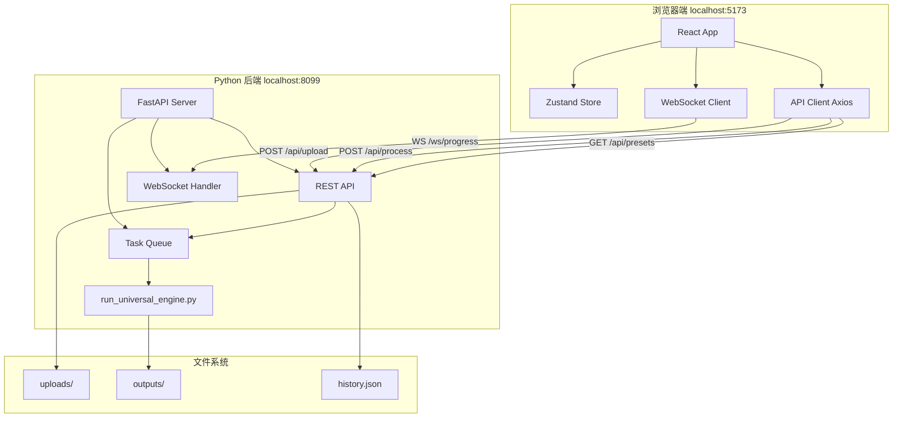
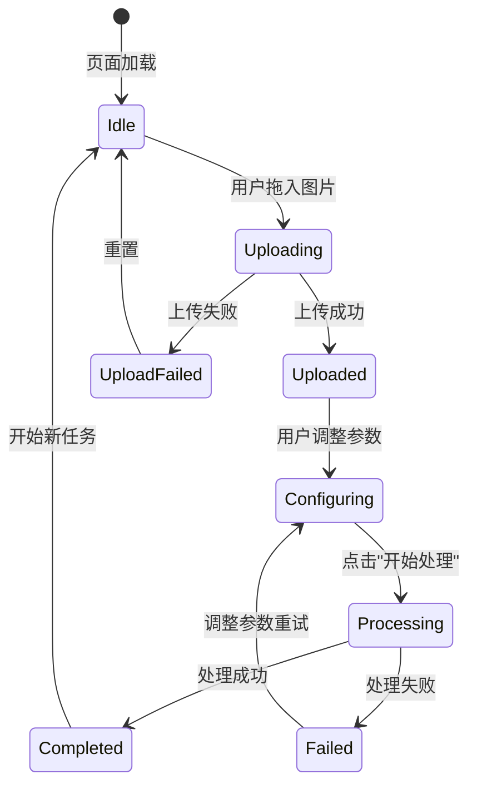

# Universal Layer Studio PRO - WebUI 技术实现规范

> **版本**: v1.0.0  
> **日期**: 2026-09-11  
> **状态**: 设计阶段 → 待开发  
> **目标**: G4 八大工程目标之一（WebUI 前端界面）

---

## 目录

1. [系统概述](#1-系统概述)
2. [技术架构](#2-技术架构)
3. [目录结构](#3-目录结构)
4. [核心功能模块](#4-核心功能模块)
5. [API 接口设计](#5-api-接口设计)
6. [UI 设计规范](#6-ui-设计规范)
7. [核心组件实现](#7-核心组件实现)
8. [开发与部署](#8-开发与部署)
9. [测试与质量保证](#9-测试与质量保证)
10. [里程碑与迭代计划](#10-里程碑与迭代计划)

---

## 1. 系统概述

### 1.1 产品定位

**Universal Layer Studio PRO WebUI** 是一个本地桌面 Web 应用，为设计师和印前工程师提供可视化的智能图像分层与制版工作流。

**核心价值**：
- 🎨 **零门槛操作** — 拖拽上传、一键处理，无需记忆命令行参数
- 📊 **实时反馈** — WebSocket 推送进度日志，处理状态透明可见
- 🔍 **智能推荐** — 根据图片特征自动推荐最佳 preset
- 📦 **结果管理** — 历史记录、批量下载、manifest 可视化

### 1.2 使用场景


**典型用户画像**：
- 软装壁布设计师（需要 CMYK 制版）
- 传统书画复刻工作室（需要高保真分层）
- 印刷厂印前工程师（需要 TAC 合规验证）

### 1.3 系统边界

**包含功能**（MVP）：
- ✅ 图片上传与格式校验
- ✅ Preset 选择与参数配置
- ✅ 任务提交与实时进度
- ✅ 结果下载与缩略图预览
- ✅ 历史记录查看

**不包含功能**（后续迭代）：
- ❌ 在线 PSB 图层编辑器
- ❌ 多用户权限管理
- ❌ 云端存储与分享
- ❌ 批量任务队列（单任务串行）

---

## 2. 技术架构

### 2.1 技术栈选型

| 层级 | 技术 | 版本 | 选型理由 |
|---|---|---|---|
| **前端框架** | React | 18.3+ | 生态成熟、组件化、TypeScript 友好 |
| **状态管理** | Zustand | 4.5+ | 轻量、无 boilerplate、TypeScript 原生支持 |
| **UI 组件库** | shadcn/ui | latest | 基于 Radix UI，无运行时依赖，可定制性强 |
| **样式方案** | Tailwind CSS | 3.4+ | 实用优先、构建时优化、与 shadcn/ui 原生集成 |
| **构建工具** | Vite | 5.0+ | HMR 快、打包小、开发体验好 |
| **后端框架** | FastAPI | 0.115+ | 异步高性能、自动生成 OpenAPI、WebSocket 原生支持 |
| **WebSocket** | FastAPI WebSocket | - | 实时进度推送 |
| **文件上传** | python-multipart | 0.0.9+ | FastAPI 文件上传依赖 |
| **图片处理** | Pillow | 10.4+ | 缩略图生成 |

### 2.2 架构图



### 2.3 数据流

**处理流程**：
1. 用户拖拽上传图片 → 前端校验（格式/大小）→ POST `/api/upload`
2. 后端保存到 `uploads/` → 返回 `file_id` + 缩略图 URL
3. 用户选择 preset + 参数 → POST `/api/process` → 返回 `task_id`
4. 前端建立 WebSocket `/ws/progress/{task_id}` 订阅进度
5. 后端异步执行 `run_universal_engine.py` → 推送日志到 WebSocket
6. 处理完成 → 前端显示下载按钮 → GET `/api/download/{task_id}`

### 2.4 目录结构

```
E:/CK/C-desk/CK-WORKS/PSD图层处理 - WorkBuddy/
├── webui/                          # 新增 WebUI 模块
│   ├── frontend/                   # React 前端
│   │   ├── src/
│   │   │   ├── components/         # UI 组件
│   │   │   │   ├── layout/         # 布局组件（Header/Sidebar）
│   │   │   │   ├── upload/         # 上传区域
│   │   │   │   ├── config/         # 配置面板
│   │   │   │   ├── progress/       # 进度显示
│   │   │   │   └── result/         # 结果展示
│   │   │   ├── stores/             # Zustand 状态管理
│   │   │   ├── api/                # API 客户端
│   │   │   ├── hooks/              # 自定义 Hooks
│   │   │   ├── types/              # TypeScript 类型定义
│   │   │   ├── utils/              # 工具函数
│   │   │   ├── App.tsx             # 根组件
│   │   │   └── main.tsx            # 入口文件
│   │   ├── public/                 # 静态资源
│   │   ├── index.html
│   │   ├── package.json
│   │   ├── tsconfig.json
│   │   ├── vite.config.ts
│   │   └── tailwind.config.js
│   │
│   ├── backend/                    # FastAPI 后端
│   │   ├── main.py                 # 主服务入口
│   │   ├── api/                    # API 路由
│   │   │   ├── upload.py
│   │   │   ├── process.py
│   │   │   ├── download.py
│   │   │   └── presets.py
│   │   ├── ws/                     # WebSocket 处理
│   │   │   └── progress.py
│   │   ├── core/                   # 核心逻辑
│   │   │   ├── task_manager.py     # 任务管理
│   │   │   ├── file_handler.py     # 文件操作
│   │   │   └── engine_wrapper.py   # 引擎封装
│   │   ├── models/                 # Pydantic 模型
│   │   └── utils/                  # 工具函数
│   │
│   ├── data/                       # 运行时数据
│   │   ├── uploads/                # 用户上传图片
│   │   ├── outputs/                # 处理结果
│   │   ├── thumbnails/             # 缩略图缓存
│   │   └── history.json            # 历史记录
│   │
│   └── README.md                   # WebUI 使用说明
│
├── engine/                         # 现有引擎（不改动）
├── tests/                          # 现有测试
└── docs/
    └── WEBUI_TECHNICAL_SPEC.md     # 本文档
```

---

## 3. 核心功能模块

### 3.1 模块分解

| 模块 | 优先级 | 功能 | 依赖 |
|---|---|---|---|
| **上传模块** | P0 | 拖拽上传、格式校验、缩略图展示 | - |
| **配置模块** | P0 | Preset 选择、参数调整、智能推荐 | 上传模块 |
| **处理模块** | P0 | 任务提交、WebSocket 进度、状态管理 | 配置模块 |
| **结果模块** | P0 | 下载按钮、缩略图预览、manifest 展示 | 处理模块 |
| **历史模块** | P1 | 历史记录列表、快速重跑、结果对比 | 结果模块 |

### 3.2 状态机设计



---

## 4. API 接口设计

### 4.1 RESTful API 规范

**基础 URL**: `http://localhost:8099/api`

**通用响应格式**：
```typescript
interface ApiResponse<T> {
  success: boolean
  data?: T
  error?: {
    code: string
    message: string
    details?: any
  }
  timestamp: string
}
```

### 4.2 接口清单

#### 4.2.1 图片上传

```http
POST /api/upload
Content-Type: multipart/form-data

Body:
  file: File (JPG/PNG/PSD, max 100MB)

Response 200:
{
  "success": true,
  "data": {
    "file_id": "20260911_142531_a3f2b1",
    "filename": "landscape.jpg",
    "size": 5242880,
    "dimensions": {
      "width": 4000,
      "height": 3000
    },
    "thumbnail_url": "/api/thumbnails/20260911_142531_a3f2b1.jpg",
    "recommended_preset": "japanese_screen_gold",
    "confidence": 0.85
  }
}

Error 400:
{
  "success": false,
  "error": {
    "code": "INVALID_FORMAT",
    "message": "不支持的文件格式，请上传 JPG/PNG/PSD"
  }
}
```

#### 4.2.2 获取 Preset 列表

```http
GET /api/presets

Response 200:
{
  "success": true,
  "data": [
    {
      "name": "japanese_screen_gold",
      "display_name": "日本金地屏风",
      "description": "长泽芦雪《金地山水图》标准",
      "thumbnail": "/api/preset-thumbnails/japanese_screen_gold.jpg",
      "semantic_classes": 7,
      "recommended_for": ["屏风", "烫金"],
      "output_modes": ["design", "plate"]
    },
    {
      "name": "textile_damask",
      "display_name": "壁布大马士革纹样",
      "description": "1:1 工业分层印前制版",
      "thumbnail": "/api/preset-thumbnails/textile_damask.jpg",
      "semantic_classes": 2,
      "recommended_for": ["壁布"],
      "output_modes": ["plate"]
    }
  ]
}
```

#### 4.2.3 提交处理任务

```http
POST /api/process
Content-Type: application/json

Body:
{
  "file_id": "20260911_142531_a3f2b1",
  "preset": "japanese_screen_gold",
  "mode": "both",
  "scale": 4.0,
  "dpi": 150.0,
  "seed": 42,
  "profile": "robust_performance"
}

Response 200:
{
  "success": true,
  "data": {
    "task_id": "task_20260911_142531_xyz",
    "estimated_time": 240,
    "ws_url": "ws://localhost:8099/ws/progress/task_20260911_142531_xyz"
  }
}

Error 400:
{
  "success": false,
  "error": {
    "code": "PRESET_INCOMPATIBLE",
    "message": "该 preset 不适用于此图片类型",
    "details": {
      "image_type": "oil_painting",
      "preset_supports": ["屏风", "烫金"]
    }
  }
}
```

#### 4.2.4 WebSocket 进度推送

```
WS /ws/progress/{task_id}

推送消息格式：
{
  "type": "progress",
  "task_id": "task_20260911_142531_xyz",
  "stage": "神经分割",
  "progress": 35,
  "message": "[GroundedSAMProvider] 正在分割第 3/7 类...",
  "timestamp": "2026-09-11T14:25:45.123Z"
}

{
  "type": "completed",
  "task_id": "task_20260911_142531_xyz",
  "elapsed_time": 238.6,
  "output_files": [
    {
      "type": "design",
      "filename": "Rosetsu_Master_16k.design.psb",
      "size": 1520435200,
      "download_url": "/api/download/task_20260911_142531_xyz/design"
    },
    {
      "type": "plate",
      "filename": "Rosetsu_Master_16k.plate.psb",
      "size": 1857028096,
      "download_url": "/api/download/task_20260911_142531_xyz/plate"
    }
  ],
  "manifest": {
    "effective_ppi": 150.0,
    "scale_factor": 4.0,
    "tac_limit": 300.0,
    "generation_ratio": 0.0823,
    "seed": 42
  }
}

{
  "type": "error",
  "task_id": "task_20260911_142531_xyz",
  "error": {
    "code": "ENGINE_ERROR",
    "message": "CUDA out of memory"
  }
}
```

#### 4.2.5 下载结果

```http
GET /api/download/{task_id}/{file_type}
  file_type: design | plate | manifest | masks

Response 200:
  Content-Type: application/octet-stream
  Content-Disposition: attachment; filename="Rosetsu_Master_16k.design.psb"
  
  <binary data>
```

#### 4.2.6 历史记录

```http
GET /api/history?limit=20&offset=0

Response 200:
{
  "success": true,
  "data": {
    "total": 48,
    "items": [
      {
        "task_id": "task_20260911_142531_xyz",
        "filename": "landscape.jpg",
        "preset": "japanese_screen_gold",
        "status": "completed",
        "created_at": "2026-09-11T14:25:31Z",
        "completed_at": "2026-09-11T14:29:29Z",
        "elapsed_time": 238.6,
        "thumbnail_url": "/api/thumbnails/task_20260911_142531_xyz.jpg"
      }
    ]
  }
}
```

### 4.3 OpenAPI 文档

FastAPI 自动生成，访问 `http://localhost:8099/docs` 查看交互式文档。

---

## 5. UI 设计规范

### 5.1 设计原则

1. **简洁大气** — 去除冗余装饰，聚焦核心操作流
2. **现代专业** — 深色主题为主（印前行业习惯），高对比度易读
3. **状态清晰** — 每个阶段有明确的视觉反馈
4. **响应迅速** — 本地应用，交互延迟 <100ms

### 5.2 色彩系统

基于 Tailwind 默认调色板扩展：

```javascript
// tailwind.config.js
module.exports = {
  theme: {
    extend: {
      colors: {
        primary: {
          50: '#f0f9ff',
          500: '#3b82f6',  // 主色调（蓝色）
          600: '#2563eb',
          700: '#1d4ed8',
        },
        success: '#10b981',  // 绿色（成功状态）
        warning: '#f59e0b',  // 橙色（警告）
        error: '#ef4444',    // 红色（错误）
        neutral: {
          50: '#fafafa',
          800: '#262626',    // 深色背景
          900: '#171717',
        }
      }
    }
  }
}
```

**应用场景**：
- `primary` — 按钮、链接、进度条
- `success` — 处理完成、校验通过
- `warning` — 参数异常、建议优化
- `error` — 失败状态、错误提示
- `neutral-900` — 页面背景
- `neutral-800` — 卡片背景

### 5.3 布局结构

```
┌─────────────────────────────────────────────────────┐
│ Header (64px)                                       │
│ Logo | Universal Layer Studio PRO         [设置]   │
├──────────┬──────────────────────────────────────────┤
│          │                                          │
│ Sidebar  │  Main Content Area                      │
│ (240px)  │                                          │
│          │  ┌─────────────────────────────────┐    │
│ • 新任务  │  │                                 │    │
│ • 历史   │  │   Upload Zone (拖拽区域)         │    │
│ • 设置   │  │                                 │    │
│          │  └─────────────────────────────────┘    │
│          │                                          │
│          │  ┌─────────────────────────────────┐    │
│          │  │  Config Panel (配置面板)         │    │
│          │  └─────────────────────────────────┘    │
│          │                                          │
│          │  ┌─────────────────────────────────┐    │
│          │  │  Progress Area (进度显示)        │    │
│          │  └─────────────────────────────────┘    │
│          │                                          │
└──────────┴──────────────────────────────────────────┘
```

### 5.4 组件规范

#### 5.4.1 上传区域

**视觉**：
- 虚线边框 `border-dashed border-2 border-neutral-700`
- 拖拽时高亮 `border-primary-500 bg-primary-500/10`
- 中心图标 + 文字提示

**交互**：
- 支持拖拽、点击选择
- 实时显示文件名、大小、进度条
- 上传完成显示缩略图（800px 宽）

**代码示例**（伪代码）：
```tsx
<div 
  className="border-2 border-dashed border-neutral-700 rounded-lg p-12
             hover:border-primary-500 transition-colors cursor-pointer"
  onDrop={handleDrop}
  onDragOver={handleDragOver}
>
  {!file ? (
    <>
      <UploadIcon className="w-12 h-12 text-neutral-500 mx-auto" />
      <p className="mt-4 text-neutral-400">
        拖拽图片到此处，或点击选择文件
      </p>
      <p className="text-sm text-neutral-600">
        支持 JPG/PNG/PSD，最大 100MB
      </p>
    </>
  ) : (
    
  )}
</div>
```

#### 5.4.2 Preset 选择器

**视觉**：
- 卡片式网格布局 `grid grid-cols-3 gap-4`
- 每张卡片包含缩略图 + 名称 + 描述
- 选中时蓝色边框 `ring-2 ring-primary-500`
- 推荐项显示徽章 `<Badge>推荐</Badge>`

**交互**：
- 点击选中
- Hover 显示详细信息（tooltip）
- 智能推荐项置顶

#### 5.4.3 参数面板

**字段**：
```typescript
interface ProcessConfig {
  mode: 'design' | 'plate' | 'both'
  scale: number  // 1.0 - 8.0, step 0.5
  dpi: number    // 72 - 300
  seed: number   // 0 - 65535, 可选
  profile: 'fast' | 'balanced' | 'robust_performance'
}
```

**布局**：
- 垂直堆叠表单
- Label 在左、Input 在右
- 每个字段下方显示帮助文本
- 高级选项折叠隐藏（`<Collapsible>`）

#### 5.4.4 进度显示

**视觉元素**：
1. 进度条：线性进度 0-100%
2. 阶段标签：如"神经分割 35%"
3. 日志滚动区：最新 20 条日志，等宽字体
4. 耗时显示：已用时间 + 预估剩余

**实时更新**：
- WebSocket 推送 → Zustand Store → React 组件自动刷新

**代码示例**：
```tsx
<div className="space-y-4">
  <div>
    <div className="flex justify-between text-sm mb-2">
      <span>{currentStage}</span>
      <span>{progress}%</span>
    </div>
    <Progress value={progress} className="h-2" />
  </div>
  
  <div className="bg-neutral-900 rounded p-4 h-64 overflow-y-auto font-mono text-xs">
    {logs.map((log, i) => (
      <div key={i} className="text-neutral-400">
        [{log.timestamp}] {log.message}
      </div>
    ))}
  </div>
  
  <div className="text-sm text-neutral-500">
    已耗时 {elapsedTime}s / 预估剩余 {estimatedRemaining}s
  </div>
</div>
```

#### 5.4.5 结果展示

**布局**：
- 左侧：缩略图（1200px 宽度适配）
- 右侧：下载按钮组 + Manifest 信息卡片

**下载按钮**：
```tsx
<div className="grid grid-cols-2 gap-4">
  <Button onClick={() => download('design')}>
    <DownloadIcon /> 设计线 (1.45 GB)
  </Button>
  <Button onClick={() => download('plate')}>
    <DownloadIcon /> 制版线 (1.73 GB)
  </Button>
  <Button variant="outline" onClick={() => download('manifest')}>
    <FileIcon /> Manifest JSON
  </Button>
  <Button variant="outline" onClick={() => download('masks')}>
    <FolderIcon /> 掩码 ZIP
  </Button>
</div>
```

**Manifest 信息卡**：
```tsx
<Card>
  <CardHeader>
    <CardTitle>处理元数据</CardTitle>
  </CardHeader>
  <CardContent className="space-y-2">
    <div className="flex justify-between">
      <span className="text-neutral-400">有效 PPI</span>
      <span className="font-mono">{manifest.effective_ppi}</span>
    </div>
    <div className="flex justify-between">
      <span className="text-neutral-400">放大倍率</span>
      <span className="font-mono">{manifest.scale_factor}×</span>
    </div>
    <div className="flex justify-between">
      <span className="text-neutral-400">TAC 限制</span>
      <span className="font-mono">{manifest.tac_limit}%</span>
    </div>
    <div className="flex justify-between">
      <span className="text-neutral-400">生成占比</span>
      <span className="font-mono">{(manifest.generation_ratio * 100).toFixed(2)}%</span>
    </div>
    <div className="flex justify-between">
      <span className="text-neutral-400">随机种子</span>
      <span className="font-mono">{manifest.seed}</span>
    </div>
  </CardContent>
</Card>
```

### 5.5 响应式设计

**断点**：
- `sm`: 640px（移动端不支持，仅提示"请在桌面端使用"）
- `lg`: 1024px（标准笔记本）
- `xl`: 1280px（台式机，侧边栏展开）

---

## 6. 核心组件实现

### 6.1 前端状态管理

**Zustand Store 设计**：

```typescript
// src/stores/useAppStore.ts
import { create } from 'zustand'

interface AppState {
  // 上传状态
  uploadedFile: UploadedFile | null
  isUploading: boolean
  uploadProgress: number
  
  // 配置状态
  selectedPreset: string | null
  config: ProcessConfig
  
  // 处理状态
  currentTask: Task | null
  taskStatus: 'idle' | 'processing' | 'completed' | 'failed'
  progress: number
  logs: LogEntry[]
  
  // 历史记录
  history: HistoryItem[]
  
  // Actions
  uploadFile: (file: File) => Promise<void>
  selectPreset: (presetName: string) => void
  updateConfig: (config: Partial<ProcessConfig>) => void
  startProcessing: () => Promise<void>
  resetTask: () => void
  fetchHistory: () => Promise<void>
}

export const useAppStore = create<AppState>((set, get) => ({
  // 初始状态
  uploadedFile: null,
  isUploading: false,
  uploadProgress: 0,
  selectedPreset: null,
  config: {
    mode: 'both',
    scale: 4.0,
    dpi: 150.0,
    seed: undefined,
    profile: 'balanced'
  },
  currentTask: null,
  taskStatus: 'idle',
  progress: 0,
  logs: [],
  history: [],
  
  // Actions 实现
  uploadFile: async (file) => {
    set({ isUploading: true, uploadProgress: 0 })
    try {
      const formData = new FormData()
      formData.append('file', file)
      
      const response = await axios.post('/api/upload', formData, {
        onUploadProgress: (e) => {
          const progress = Math.round((e.loaded * 100) / e.total!)
          set({ uploadProgress: progress })
        }
      })
      
      set({
        uploadedFile: response.data.data,
        isUploading: false,
        selectedPreset: response.data.data.recommended_preset
      })
    } catch (error) {
      set({ isUploading: false })
      throw error
    }
  },
  
  startProcessing: async () => {
    const { uploadedFile, selectedPreset, config } = get()
    if (!uploadedFile || !selectedPreset) return
    
    const response = await axios.post('/api/process', {
      file_id: uploadedFile.file_id,
      preset: selectedPreset,
      ...config
    })
    
    const { task_id, ws_url } = response.data.data
    set({ 
      currentTask: { task_id },
      taskStatus: 'processing',
      progress: 0,
      logs: []
    })
    
    // 建立 WebSocket 连接
    const ws = new WebSocket(ws_url)
    ws.onmessage = (event) => {
      const msg = JSON.parse(event.data)
      if (msg.type === 'progress') {
        set({ 
          progress: msg.progress,
          logs: [...get().logs, msg]
        })
      } else if (msg.type === 'completed') {
        set({ 
          taskStatus: 'completed',
          currentTask: { ...get().currentTask!, ...msg }
        })
        ws.close()
      } else if (msg.type === 'error') {
        set({ taskStatus: 'failed' })
        ws.close()
      }
    }
  },
  
  // ... 其他 actions
}))
```

### 6.2 API 客户端封装

```typescript
// src/api/client.ts
import axios from 'axios'

const apiClient = axios.create({
  baseURL: 'http://localhost:8099/api',
  timeout: 30000,
  headers: {
    'Content-Type': 'application/json'
  }
})

// 响应拦截器
apiClient.interceptors.response.use(
  (response) => response,
  (error) => {
    const message = error.response?.data?.error?.message || '网络错误'
    // 全局错误提示（集成 toast）
    toast.error(message)
    return Promise.reject(error)
  }
)

export default apiClient
```

### 6.3 WebSocket Hook

```typescript
// src/hooks/useWebSocket.ts
import { useEffect, useRef } from 'react'

export function useWebSocket(url: string | null, onMessage: (data: any) => void) {
  const wsRef = useRef<WebSocket | null>(null)
  
  useEffect(() => {
    if (!url) return
    
    const ws = new WebSocket(url)
    wsRef.current = ws
    
    ws.onopen = () => console.log('WebSocket connected')
    ws.onmessage = (event) => {
      const data = JSON.parse(event.data)
      onMessage(data)
    }
    ws.onerror = (error) => console.error('WebSocket error:', error)
    ws.onclose = () => console.log('WebSocket closed')
    
    return () => {
      ws.close()
    }
  }, [url])
  
  return wsRef
}
```

### 6.4 后端核心模块

#### 6.4.1 任务管理器

```python
# webui/backend/core/task_manager.py
import asyncio
import subprocess
import uuid
from datetime import datetime
from pathlib import Path
from typing import Dict, Optional

class TaskManager:
    def __init__(self):
        self.tasks: Dict[str, dict] = {}
        self.active_process: Optional[subprocess.Popen] = None
    
    def create_task(self, file_id: str, config: dict) -> str:
        task_id = f"task_{datetime.now().strftime('%Y%m%d_%H%M%S')}_{uuid.uuid4().hex[:6]}"
        self.tasks[task_id] = {
            "task_id": task_id,
            "file_id": file_id,
            "config": config,
            "status": "pending",
            "created_at": datetime.now().isoformat(),
            "progress": 0,
            "logs": []
        }
        return task_id
    
    async def execute_task(self, task_id: str, progress_callback):
        task = self.tasks[task_id]
        task["status"] = "processing"
        
        # 构建命令行
        input_path = Path("webui/data/uploads") / f"{task['file_id']}.jpg"
        output_path = Path("webui/data/outputs") / task_id
        output_path.mkdir(parents=True, exist_ok=True)
        
        config = task["config"]
        cmd = [
            "python", "-u", "run_universal_engine.py",
            "--input", str(input_path),
            "--output", str(output_path / "result.psb"),
            "--preset", config["preset"],
            "--mode", config["mode"],
            "--scale", str(config["scale"]),
            "--dpi", str(config["dpi"]),
            "--profile", config["profile"]
        ]
        
        if config.get("seed"):
            cmd.extend(["--seed", str(config["seed"])])
        
        # 执行进程
        process = await asyncio.create_subprocess_exec(
            *cmd,
            stdout=asyncio.subprocess.PIPE,
            stderr=asyncio.subprocess.STDOUT
        )
        
        self.active_process = process
        
        # 读取输出并推送进度
        async for line in process.stdout:
            log_line = line.decode('utf-8').strip()
            task["logs"].append({
                "timestamp": datetime.now().isoformat(),
                "message": log_line
            })
            
            # 解析进度（简化版，实际需要正则匹配）
            if "%" in log_line:
                try:
                    progress = int(log_line.split("%")[0].split()[-1])
                    task["progress"] = progress
                    await progress_callback(task_id, progress, log_line)
                except:
                    pass
        
        await process.wait()
        
        if process.returncode == 0:
            task["status"] = "completed"
            task["completed_at"] = datetime.now().isoformat()
        else:
            task["status"] = "failed"
            task["error"] = "处理失败，请查看日志"
    
    def get_task(self, task_id: str) -> dict:
        return self.tasks.get(task_id)

task_manager = TaskManager()
```

#### 6.4.2 WebSocket 处理器

```python
# webui/backend/ws/progress.py
from fastapi import WebSocket, WebSocketDisconnect
from core.task_manager import task_manager

class ConnectionManager:
    def __init__(self):
        self.active_connections: dict[str, list[WebSocket]] = {}
    
    async def connect(self, task_id: str, websocket: WebSocket):
        await websocket.accept()
        if task_id not in self.active_connections:
            self.active_connections[task_id] = []
        self.active_connections[task_id].append(websocket)
    
    def disconnect(self, task_id: str, websocket: WebSocket):
        self.active_connections[task_id].remove(websocket)
    
    async def broadcast(self, task_id: str, message: dict):
        if task_id in self.active_connections:
            for connection in self.active_connections[task_id]:
                await connection.send_json(message)

manager = ConnectionManager()

async def websocket_endpoint(websocket: WebSocket, task_id: str):
    await manager.connect(task_id, websocket)
    
    async def progress_callback(tid: str, progress: int, message: str):
        await manager.broadcast(tid, {
            "type": "progress",
            "task_id": tid,
            "progress": progress,
            "message": message,
            "timestamp": datetime.now().isoformat()
        })
    
    try:
        # 启动任务处理
        await task_manager.execute_task(task_id, progress_callback)
        
        # 处理完成，推送结果
        task = task_manager.get_task(task_id)
        await manager.broadcast(task_id, {
            "type": "completed",
            "task_id": task_id,
            "output_files": [...],  # 从 task 中提取
            "manifest": {...}
        })
        
    except WebSocketDisconnect:
        manager.disconnect(task_id, websocket)
    except Exception as e:
        await manager.broadcast(task_id, {
            "type": "error",
            "task_id": task_id,
            "error": {"message": str(e)}
        })
```

#### 6.4.3 FastAPI 主入口

```python
# webui/backend/main.py
from fastapi import FastAPI, UploadFile, File, WebSocket
from fastapi.middleware.cors import CORSMiddleware
from fastapi.staticfiles import StaticFiles
from pathlib import Path

from api.upload import router as upload_router
from api.process import router as process_router
from api.download import router as download_router
from api.presets import router as presets_router
from ws.progress import websocket_endpoint

app = FastAPI(
    title="Universal Layer Studio PRO API",
    version="1.0.0",
    docs_url="/docs",
    redoc_url="/redoc"
)

# CORS 配置
app.add_middleware(
    CORSMiddleware,
    allow_origins=["http://localhost:5173"],  # Vite 开发服务器
    allow_credentials=True,
    allow_methods=["*"],
    allow_headers=["*"],
)

# 挂载静态文件
app.mount("/thumbnails", StaticFiles(directory="webui/data/thumbnails"), name="thumbnails")
app.mount("/preset-thumbnails", StaticFiles(directory="webui/backend/static/presets"), name="preset-thumbnails")

# 注册路由
app.include_router(upload_router, prefix="/api")
app.include_router(process_router, prefix="/api")
app.include_router(download_router, prefix="/api")
app.include_router(presets_router, prefix="/api")

# WebSocket 路由
@app.websocket("/ws/progress/{task_id}")
async def progress_ws(websocket: WebSocket, task_id: str):
    await websocket_endpoint(websocket, task_id)

@app.get("/")
async def root():
    return {"message": "Universal Layer Studio PRO API", "status": "running"}

if __name__ == "__main__":
    import uvicorn
    uvicorn.run(app, host="0.0.0.0", port=8099)
```

---

## 7. 开发与部署

### 7.1 开发环境搭建

#### 后端

```bash
# 1. 创建虚拟环境
cd webui/backend
python -m venv venv
source venv/bin/activate  # Windows: venv\Scripts\activate

# 2. 安装依赖
pip install fastapi uvicorn[standard] python-multipart pillow

# 3. 启动开发服务器
uvicorn main:app --reload --port 8099
```

#### 前端

```bash
# 1. 初始化项目
cd webui/frontend
npm create vite@latest . -- --template react-ts
npm install

# 2. 安装依赖
npm install zustand axios
npm install -D tailwindcss postcss autoprefixer
npx tailwindcss init -p

# 3. 安装 shadcn/ui
npx shadcn-ui@latest init
npx shadcn-ui@latest add button card progress input label select

# 4. 启动开发服务器
npm run dev  # 默认 http://localhost:5173
```

### 7.2 构建与打包

#### 前端生产构建

```bash
cd webui/frontend
npm run build
# 输出到 dist/ 目录
```

#### 后端集成前端

```python
# webui/backend/main.py
from fastapi.staticfiles import StaticFiles

# 挂载前端构建产物
app.mount("/", StaticFiles(directory="webui/frontend/dist", html=True), name="frontend")
```

#### 一键启动脚本

```bash
# webui/start.sh (Linux/macOS)
#!/bin/bash
cd "$(dirname "$0")"
source backend/venv/bin/activate
cd ..
python -m uvicorn webui.backend.main:app --host 0.0.0.0 --port 8099
```

```batch
@echo off
REM webui/start.bat (Windows)
cd /d "%~dp0"
call backend\venv\Scripts\activate.bat
cd ..
python -m uvicorn webui.backend.main:app --host 0.0.0.0 --port 8099
pause
```

### 7.3 Docker 部署（可选）

```dockerfile
# webui/Dockerfile
FROM python:3.12-slim

WORKDIR /app

# 安装系统依赖
RUN apt-get update && apt-get install -y \
    libgl1-mesa-glx \
    libglib2.0-0 \
    && rm -rf /var/lib/apt/lists/*

# 复制项目文件
COPY requirements.txt requirements-ai.txt ./
COPY webui/backend/requirements.txt ./webui-requirements.txt

# 安装 Python 依赖
RUN pip install --no-cache-dir -r requirements.txt \
    && pip install --no-cache-dir -r requirements-ai.txt \
    && pip install --no-cache-dir -r webui-requirements.txt

COPY . .

# 暴露端口
EXPOSE 8099

# 启动命令
CMD ["uvicorn", "webui.backend.main:app", "--host", "0.0.0.0", "--port", "8099"]
```

```yaml
# docker-compose.yml
version: '3.8'

services:
  uls-webui:
    build: .
    ports:
      - "8099:8099"
    volumes:
      - ./webui/data:/app/webui/data
      - ./checkpoints:/app/checkpoints
    environment:
      - CUDA_VISIBLE_DEVICES=0
    deploy:
      resources:
        reservations:
          devices:
            - driver: nvidia
              count: 1
              capabilities: [gpu]
```

---

## 8. 测试与质量保证

### 8.1 单元测试

#### 前端测试（Vitest）

```typescript
// webui/frontend/src/stores/useAppStore.test.ts
import { describe, it, expect, beforeEach } from 'vitest'
import { useAppStore } from './useAppStore'

describe('AppStore', () => {
  beforeEach(() => {
    useAppStore.setState({
      uploadedFile: null,
      selectedPreset: null
    })
  })
  
  it('should upload file', async () => {
    const file = new File(['test'], 'test.jpg', { type: 'image/jpeg' })
    await useAppStore.getState().uploadFile(file)
    expect(useAppStore.getState().uploadedFile).not.toBeNull()
  })
  
  it('should select preset', () => {
    useAppStore.getState().selectPreset('japanese_screen_gold')
    expect(useAppStore.getState().selectedPreset).toBe('japanese_screen_gold')
  })
})
```

#### 后端测试（pytest）

```python
# webui/backend/tests/test_api.py
import pytest
from fastapi.testclient import TestClient
from main import app

client = TestClient(app)

def test_get_presets():
    response = client.get("/api/presets")
    assert response.status_code == 200
    data = response.json()
    assert data["success"] is True
    assert len(data["data"]) >= 5

def test_upload_file():
    with open("tests/fixtures/test.jpg", "rb") as f:
        response = client.post(
            "/api/upload",
            files={"file": ("test.jpg", f, "image/jpeg")}
        )
    assert response.status_code == 200
    assert "file_id" in response.json()["data"]
```

### 8.2 E2E 测试（Playwright）

```typescript
// webui/frontend/e2e/workflow.spec.ts
import { test, expect } from '@playwright/test'

test('complete processing workflow', async ({ page }) => {
  await page.goto('http://localhost:5173')
  
  // 上传图片
  const fileInput = page.locator('input[type="file"]')
  await fileInput.setInputFiles('tests/fixtures/landscape.jpg')
  await expect(page.locator('img[alt="thumbnail"]')).toBeVisible()
  
  // 选择 preset
  await page.click('text=日本金地屏风')
  
  // 提交处理
  await page.click('button:has-text("开始处理")')
  
  // 等待完成（最多 5 分钟）
  await expect(page.locator('text=处理完成')).toBeVisible({ timeout: 300000 })
  
  // 验证下载按钮
  await expect(page.locator('button:has-text("设计线")')).toBeEnabled()
  await expect(page.locator('button:has-text("制版线")')).toBeEnabled()
})
```

### 8.3 性能测试

**关键指标**：
- 页面加载时间 < 1s
- 交互响应延迟 < 100ms
- WebSocket 推送延迟 < 50ms
- 缩略图生成时间 < 2s

**工具**：
- Lighthouse（前端性能审计）
- locust（后端 API 压力测试）

---

## 9. 里程碑与迭代计划

### 9.1 MVP 阶段（Week 1-2）

**目标**：核心流程可用

| 任务 | 负责模块 | 预估工时 |
|---|---|---|
| 后端 API 框架搭建 | FastAPI + 路由 | 4h |
| 前端项目初始化 | Vite + React + Tailwind | 2h |
| 上传模块实现 | 前后端 | 6h |
| Preset 列表与选择 | 前后端 | 4h |
| 参数配置面板 | 前端 | 4h |
| 任务提交与进度 | 前后端 + WebSocket | 8h |
| 结果下载 | 前后端 | 4h |
| 端到端测试 | E2E | 4h |
| **总计** | - | **36h** |

**交付物**：
- 可运行的本地 WebUI
- 支持单任务串行处理
- 基础错误处理

### 9.2 优化阶段（Week 3）

**目标**：体验优化

| 任务 | 内容 | 预估工时 |
|---|---|---|
| 历史记录功能 | 列表展示 + 快速重跑 | 4h |
| 智能推荐优化 | 图片特征分析 → 推荐置信度 | 4h |
| 错误处理增强 | 友好错误提示 + 重试机制 | 3h |
| 性能优化 | 缩略图懒加载 + 代码分割 | 3h |
| UI 细节打磨 | 动画过渡 + 响应式适配 | 4h |
| 单元测试覆盖 | 核心逻辑 80% 覆盖 | 6h |
| **总计** | - | **24h** |

### 9.3 扩展阶段（Week 4+）

**可选功能**：
- 批量任务队列（支持多图排队处理）
- 在线 PSB 预览器（图层展开/切换）
- 参数模板保存（常用配置一键加载）
- 性能监控面板（GPU/内存使用率）
- 暗色/亮色主题切换
- 国际化（中文/英文）

---

## 10. 附录

### 10.1 技术债务与风险

| 风险项 | 影响 | 缓解措施 |
|---|---|---|
| 大文件上传超时 | 用户体验差 | 前端分片上传 + 后端断点续传 |
| 处理中用户关闭页面 | 任务中断 | 后端任务持久化 + 前端重连提示 |
| 多任务并发资源竞争 | 内存/GPU OOM | MVP 仅支持单任务，后续加队列 |
| PSB 文件过大（1.7GB） | 下载慢 | 提供 ZIP 压缩选项 |

### 10.2 依赖清单

#### 前端

```json
{
  "dependencies": {
    "react": "^18.3.1",
    "react-dom": "^18.3.1",
    "zustand": "^4.5.0",
    "axios": "^1.7.0",
    "@radix-ui/react-progress": "^1.1.0",
    "@radix-ui/react-select": "^2.1.0",
    "@radix-ui/react-dialog": "^1.1.0",
    "tailwindcss": "^3.4.0",
    "clsx": "^2.1.0",
    "lucide-react": "^0.400.0"
  },
  "devDependencies": {
    "@types/react": "^18.3.0",
    "@types/react-dom": "^18.3.0",
    "@vitejs/plugin-react": "^4.3.0",
    "typescript": "^5.5.0",
    "vite": "^5.3.0",
    "vitest": "^2.0.0",
    "@playwright/test": "^1.45.0"
  }
}
```

#### 后端

```txt
# webui/backend/requirements.txt
fastapi==0.115.0
uvicorn[standard]==0.30.0
python-multipart==0.0.9
pillow==10.4.0
pydantic==2.9.0
```

### 10.3 参考资源

- [FastAPI 官方文档](https://fastapi.tiangolo.com/)
- [React 官方文档](https://react.dev/)
- [shadcn/ui 组件库](https://ui.shadcn.com/)
- [Tailwind CSS 文档](https://tailwindcss.com/docs)
- [WebSocket API](https://developer.mozilla.org/en-US/docs/Web/API/WebSocket)

---

## 结语

本文档为 **Universal Layer Studio PRO WebUI** 提供了完整的技术实现方案，涵盖架构设计、API 定义、UI 规范、核心代码示例和开发计划。

**下一步行动**：
1. 评审本文档，确认技术选型与功能范围
2. 初始化项目目录结构
3. 启动 MVP 开发（Week 1-2）
4. 持续迭代优化

**文档维护**：
- 版本: v1.0.0
- 作者: WorkBuddy AI
- 更新日期: 2026-09-11
- 下次评审: 开发完成后

---

*本文档为 AI IDE 工具友好格式，使用 Markdown + Mermaid 图表，可直接在 VS Code / Cursor / WorkBuddy 中预览和协作开发。*
