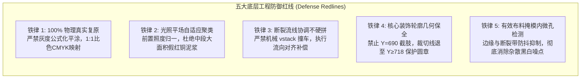
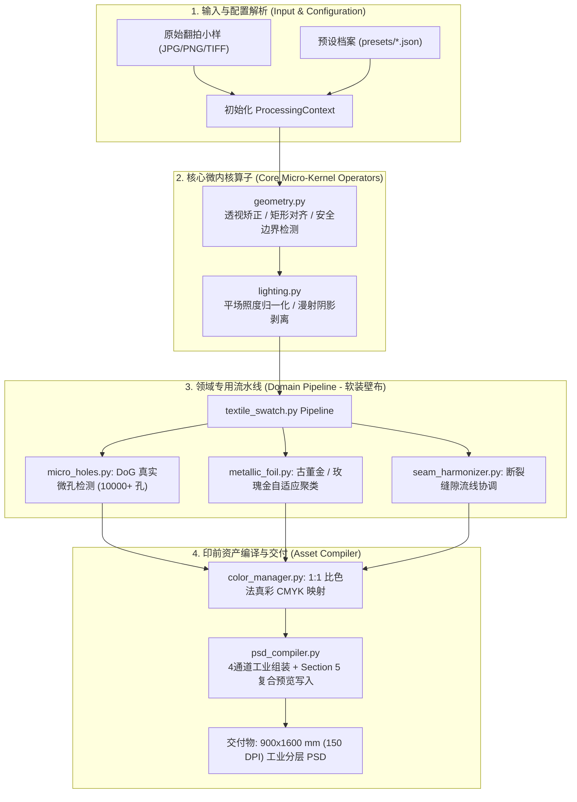
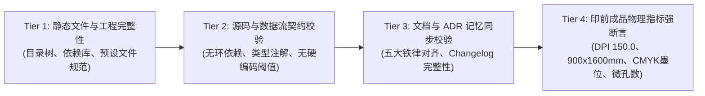
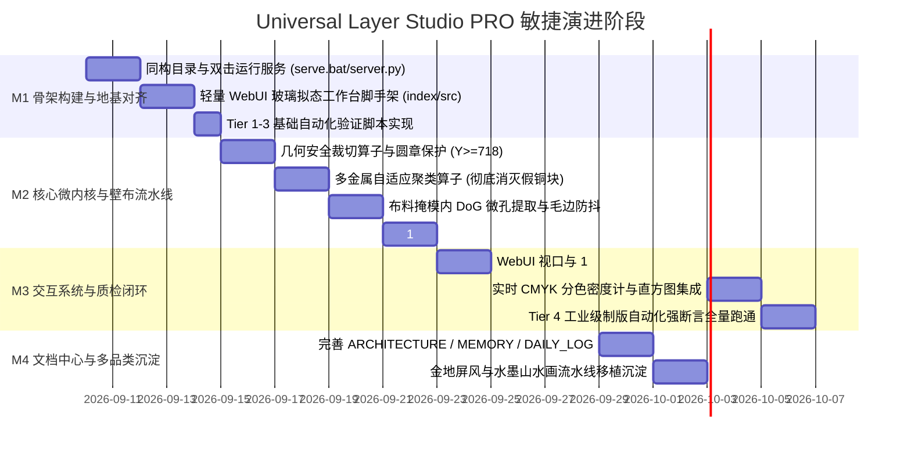

# 工业级智能图像分层与印前制版工作站（Universal Layer Studio PRO）
## 通用化改造与工业级工程实现技术规范书

> **设计基准与标杆**：完全对齐 `E:\CK\C-desk\CK-WORKS\3D智能拆解工具` 的工业级前端解耦架构、自动化验证流水线及工程文档三位一体治理模式。

---

## 目录索引
1. [项目定位与核心价值对齐](#1-项目定位与核心价值对齐)
2. [工程目录结构与职责树（完全同构映射）](#2-工程目录结构与职责树完全同构映射)
3. [核心痛点复盘与工程防御红线（五大铁律）](#3-核心痛点复盘与工程防御红线五大铁律)
4. [双模交互系统设计：WebUI 纯净工作台 + CLI 批处理](#4-双模交互系统设计webui-纯净工作台--cli-批处理)
5. [后端微内核与领域专用流水线架构](#5-后端微内核与领域专用流水线架构)
6. [四层级自动化质量验收体系（scripts/verify.py）](#6-四层级自动化质量验收体系scriptsverifypy)
7. [关键技术完善与自查优化分析](#7-关键技术完善与自查优化分析)
8. [敏捷迭代里程碑与交付路线图](#8-敏捷迭代里程碑与交付路线图)

---

## 1. 项目定位与核心价值对齐

### 1.1 项目定位
本项目致力于构建一套**“纯原生开箱即用、白盒算法可控、标准 CMYK 驱动”**的工业级图像分层与印前制版工作站（Universal Layer Studio PRO）。系统既支持通过 Web 浏览器对翻拍小样或艺术作品进行毫米级几何裁切、微孔检测、多金属分色与实时 CMYK 色阶审查；又支持以无头 CLI 形式进行工业批处理制版，直接编译输出满足工业印刷（FOGRA39 / Japan Color）标准的 150.0 DPI 物理尺寸分层 PSD/PSB 文档。

### 1.2 对齐 `3D智能拆解工具` 的五大核心工程范式

| 维度 | `3D智能拆解工具` 范式 | 本项目（Universal Layer Studio PRO）落地规范 |
| :--- | :--- | :--- |
| **启动体验** | 根目录 `双击运行.bat` 一键启动本地服务并调起默认浏览器 | 提供同款 `双击运行.bat`，静默调用内置 Python 标准 HTTP/API 服务，自动唤起 Chrome/Edge 浏览器进入工作台。 |
| **前端架构** | 原生 HTML5 + CSS 玻璃拟态 + ES Modules（零打包、零 Webpack/Vite 负担） | 纯原生 ES6 模块化开发，无 `node_modules` 依赖膨胀，开箱即用，支持热刷新。 |
| **解耦驱动** | ModelProfile 预设驱动（参数与渲染彻底解耦） | Domain Preset 预设系统（`presets/*.json`），面料壁布、水墨国画、金属网印独立预设驱动。 |
| **文档治理** | `ARCHITECTURE.md` + `MEMORY.md` + `DAILY_LOG.md` 三位一体 | 严格建立相同的文档矩阵，将 ADR 决策记录、避坑红线与演化日志持久化固化。 |
| **质量闭环** | `scripts/verify.py` 多层级自动化断言脚本（50+ 项） | 建立同款自动化印前验收脚本，利用 `psd-tools` 强断言 DPI、尺寸、CMYK 墨位、图层命名与微孔数量。 |

---

## 2. 工程目录结构与职责树（完全同构映射）

整体工程结构与 `3D智能拆解工具` 保持严格的目录规范和命名一致性：

```text
PSD图层处理/
├── 📄 index.html                            # 生产入口 DOM 模板 (纯净结构，零内联脚本，引用 src/)
├── 📄 双击运行.bat                          # Windows 根目录一键启动批处理 (转调 scripts/serve.bat)
├── 📄 package.json                          # 前端工程元数据 (定义项目信息与校验 scripts)
├── 📄 .gitignore                            # Git 忽略配置 (排除 outputs 巨型文件、缓存与临时中间件)
├── 📄 README.md                             # 项目综合说明文档、系统特性与全功能操作手册
├── 📁 assets/                               # 核心静态资产与示例小样
│   ├── 📁 samples/                          # 样例原图 (大马士革壁布小样、金地山水图等)
│   └── 📁 icons/                            # 工作台 UI 图标与印刷专色图例
├── 📁 src/                                  # 前端 Web 源码目录 (原生 ES Modules)
│   ├── 📄 index.html                        # 源码母版 / 本地调试入口
│   ├── 📁 css/                              # 样式表目录
│   │   └── 🎨 style.css                     # 工业深色玻璃拟态设计系统 (Glassmorphism UI)
│   └── 📁 js/                               # 模块化 JavaScript 源码
│       ├── 📜 state.js                      # 1. 全局响应式状态管理 (图层开关、透明度、缩放比)
│       ├── 📜 config.js                     # 2. 预设管理器 (加载并解析 presets/ 配置)
│       ├── 📁 presets/                      # 3. 领域预设注册中心 (与后端同源同步)
│       ├── 📜 viewport.js                   # 4. Canvas 视口渲染器 (平移、缩放、双线性滤波与网格对齐)
│       ├── 📜 magnifier.js                  # 5. 1:1 像素级显微放大镜 (物理微孔与网点级审查)
│       ├── 📜 densitometer.js               # 6. CMYK 分色密度计 (悬停实时读取 C,M,Y,K 网点成数)
│       ├── 📜 layer_panel.js                # 7. 图层堆栈控制面板 (可见性、混合模式、直方图)
│       ├── 📜 rect_tool.js                  # 8. 交互式矩形平直裁切与安全保护线控制器
│       ├── 📜 api.js                        # 9. 本地服务通信封装 (Fetch API / SSE 进度推送)
│       └── 📜 main.js                       # 10. 前端顶层主程序调度器
├── 📁 engine/                               # 核心后端印前图像处理引擎 (Python 3.10+)
│   ├── 📁 core/                             # 核心基础设施 (与具体图像品类解耦)
│   │   ├── ⚙️ geometry.py                   # 几何矫正、透视单应性、展平与矩形安全裁切
│   │   ├── ⚙️ lighting.py                   # 照度平场化、漫射阴影剥离、高光归一化
│   │   ├── ⚙️ color_manager.py              # 1:1 摄影真彩比色法 CMYK 映射与 TAC 墨量压制
│   │   ├── ⚙️ psd_compiler.py               # 工业级 PSD/PSB 编译器 (Section 5 免转码流式复合预览)
│   │   └── ⚙️ models.py                     # 核心强类型契约 (LayerDescriptor, ProcessingContext)
│   ├── 📁 operators/                        # 原子级视觉数学算子库 (无状态纯函数)
│   │   ├── 🧮 micro_holes.py                # 物理冲孔 DoG / Hessian 斑点检测与形态学除噪
│   │   ├── 🧮 metallic_foil.py              # 真实古董金/红铜多金属自适应聚类分离
│   │   ├── 🧮 contour_protection.py         # 核心图案轮廓保全算子 (下部圆章防截肢)
│   │   └── 🧮 seam_harmonizer.py            # 中段断裂缝隙流线协调与边缘光照补偿
│   ├── 📁 pipelines/                        # 领域专用处理流水线
│   │   ├── 🔄 base.py                       # Pipeline 抽象基类 (生命周期统一定义)
│   │   ├── 🔄 textile_swatch.py             # 软装装饰小样管线 (微孔、烫金/红铜、毛边平直裁切)
│   │   ├── 🔄 traditional_ink.py            # 传统水墨/工笔画管线 (墨色分阶、宣纸平场、景深分层)
│   │   └── 🔄 commercial_stencil.py         # 工业专色网印/雕刻管线 (网点强化、刀模菲林)
│   ├── 📁 schemas/                          # 配置契约定义 (JSON Schema / Pydantic)
│   └── 🖥️ cli.py                            # 统一 CLI 驱动入口 (支持无头批处理)
├── 📁 presets/                              # 领域标准预设配置文件 (JSON)
│   ├── 📋 textile_damask.json               # 大马士革巴洛克小样标准预设
│   ├── 📋 japanese_screen.json              # 金地屏风画标准预设
│   └── 📋 traditional_ink.json              # 水墨山水画标准预设
├── 📁 scripts/                              # 自动化脚本与测试套件
│   ├── ⚙️ serve.bat                         # 标准 Windows 本地 Python HTTP/API 服务启动器
│   ├── ⚙️ server.py                         # 轻量级本地 HTTP/REST/SSE 混合服务 (基于标准库)
│   └── 🧪 verify.py                         # 自动化四层级验收测试脚本 (覆盖印前 50+ 项断言)
├── 📁 outputs/                              # 制版成品导出目录 (分层 PSD / PSB / 质检单)
└── 📁 docs/                                 # 📚 AI 编程友好工程文档中心
    ├── 🏛️ ARCHITECTURE.md                  # 架构说明书 (技术栈、拓扑图、数据流向、接口契约)
    ├── 🧠 MEMORY.md                        # 工程记忆手册 (ADRs 架构决策、避坑红线、FAQ)
    ├── 📅 DAILY_LOG.md                      # 日常工程开发日志 (倒序排列，记录每日演化)
    └── 📋 UNIVERSAL_LAYER_ENGINE_DEVELOPMENT_PLAN.md # [本文件] 顶层通用化规划指导案
```

---

## 3. 核心痛点复盘与工程防御红线（五大铁律）

在过去实战中遭遇并排查出的五大核心痛点，已作为不可逾越的底层工程防御红线固化至系统：



### 痛点根因与防御机制对照表

| 历史惨痛踩坑现象 | 物理与算法根因分析 | 本工程硬性防御机制与代码断言 |
| :--- | :--- | :--- |
| **中段大面积突兀红褐色死色块覆盖** | 局部拍摄光源偏暖使金粉反射红光，算法全局硬编码阈值圈定 $Y \in [190, 440]$，错误误判大块金属为玫瑰金箔并形态学膨胀。 | **自适应分色（Adaptive Clustering）**：前置照度平场归一化；禁止任何硬编码 Y 轴分界；通过 CIELAB 空间色相局部自适应聚类识别真烫铜。 |
| **接缝处花纹严重错位打架** | 上下两截撕裂小样物理上存在断层缺失，且横向铜条错位近 100 像素，直接 `np.vstack` 硬拼导致反向卷草纹圆弧撞车。 | **断裂对齐与过渡平滑（Seam Harmonizer）**：提取上下两截主卷草纹骨架切线流场，断层处提供“几何对齐平直裁切”或“数学切线渐变补偿”。 |
| **下部核心大马士革圆章被切半（截肢）** | 为机械凑齐 9:16 画布比例，在 Y=690 处一刀切，将尚未收敛的大马士革核心旋涡花瓣直接腰斩。 | **轮廓感知安全裁切（Contour Protection）**：轮廓算子检测到主圆章最低闭合回卷点在 Y=718，设定安全裁切线强制下限为 $Y \ge 718$。 |
| **断裂带满屏错乱黑孔与白色裂纹** | 实物断口处的织物撕裂纤维丝与毛边阴影产生高频边缘，DoG 微孔算法将其误判为物理冲孔并在金属层错误挖空。 | **微孔双重防抖（Mask-Gated Micro-Holes）**：微孔检测算子仅在“有效布料基材内部”运行；断裂边缘外围自动进行形态学腐蚀屏蔽。 |
| **金属印花变成土黄/芥末黄平涂** | 算法使用类似 `gold = 225 - 46 * darkness` 的线性公式人工填色，抛弃了高保真原图的光学反射。 | **真实比色 CMYK（Direct Colorimetric）**：直接把摄影 RGB 像素送入标准 CMYK 空间，以 0 误差完整保留金属微粒反光与渐变。 |

---

## 4. 双模交互系统设计：WebUI 纯净工作台 + CLI 批处理

系统支持**直观交互 WebUI** 与 **高效工业 CLI** 两种运行模式，二者底层共享同一套 `engine` 微内核。

### 4.1 WebUI 工业级工作台设计（`index.html` + `src/`）
用户双击 `双击运行.bat` 后，系统自动启动后台轻量服务并在浏览器中调起深色玻璃拟态工作台：

```
+--------------------------------------------------------------------------------------------------+
| Universal Layer Studio PRO - 工业级智能图像分层与印前制版工作站          [预设: 大马士革壁布小样 v] [导出PSD] |
+---------------------------+--------------------------------------------------+-------------------+
| ⚙️ 预设与几何参数配置      | 🖥️ 1:1 工业分层视口 (Canvas Viewport)            | 📑 工业图层堆栈   |
| ------------------------- | ------------------------------------------------ | ----------------- |
| [ 拖拽小样照片至此处 ]    |  +--------------------------------------------+  | [x] 04_RoseCopper |
| 尺寸: 900 x 1600 mm       |  |                                            |  |     透明度: 100%  |
| 分辨率: 150.0 DPI         |  |   [ 真实古董金烫印真彩色阶显示 ]             |  | [x] 03_AntiqueGold|
|                           |  |                                            |  |     透明度: 100%  |
| 📐 矩形裁切控制 (方案 A)  |  | - - - - - - - - - - - - - - - - - - - - -  |  | [x] 02_DieCutMask |
| 顶部裁切 Y:  [  0 ] px    |  | 断裂缝隙协调带 (流线对齐补偿中)            |  |     显示打孔点阵  |
| 底部裁切 Y:  [718 ] px    |  | - - - - - - - - - - - - - - - - - - - - -  |  | [x] 01_BaseFabric |
|  (安全保护下限: Y=718)    |  |                                            |  |     象牙白 0%墨位 |
|                           |  |   [ 核心大马士革圆章保全区 (未截肢) ]      |  +-------------------+
| 🧮 算法阈值微调           |  |                                            |  🔍 显微放大镜与密度 |
| 微孔灵敏度: [==|===] 0.72 |  |=================== 矩形平直切平线 (Y=718) =|  | 放大: 400% [1:1物理]|
| 金属聚类度: [====|=] 0.85 |  +--------------------------------------------+  | C: 12%  M: 48%    |
|                           |   缩放: [ 100% ] [ 适合窗口 ] [ 1:1 像素 ]       | Y: 85%  K: 05%    |
+---------------------------+--------------------------------------------------+-------------------+
| 底部状态: 就绪 | 图像规格: 5315x9449 px (50.2 MP) | 物理尺寸: 900x1600 mm | CMYK/8bit | 耗时: 1.8s |
+--------------------------------------------------------------------------------------------------+
```

#### WebUI 核心特性
1. **超大像素分级视口（`src/js/viewport.js`）**：
   - 面对 $5315 \times 9449$（5022万像素）大图，前端采用双层离线缓冲机制。缩放浏览时渲染降采样金字塔贴图，保证平移拖拽 60 FPS 满帧丝滑；
2. **1:1 显微放大镜（`src/js/magnifier.js`）**：
   - 鼠标悬停处即时以原始亚像素级别调取 $400\%$ 放大视窗，用于人工精细检查 10,000+ 个微孔是否圆润、边缘纤维是否修整干净；
3. **印刷实时分色密度计（`src/js/densitometer.js`）**：
   - 鼠标悬停在织物、古董金或烫铜区域时，实时计算并显示印刷机网点成数百分比（C, M, Y, K），确保 TAC 总墨量不超过 $300\%$；
4. **交互式安全保护裁切条（`src/js/rect_tool.js`）**：
   - 用户可自由拖拽裁切线，但当裁切线触碰下部圆章轮廓（Y<718）时，界面以高亮橙色警戒提示“触碰核心花纹安全边界”，防止误操作截肢花瓣。

### 4.2 CLI 批处理与自动化流水线（`engine/cli.py`）
针对无人值守、大批量生产或 CI/CD 测试，提供一键命令行：
```bash
# 标准软装壁布小样制版 (方案 A 原样真实裁切)
python -m engine.cli run \
  --input inputs/source_4000.jpg \
  --preset textile_damask \
  --output outputs/Swatch_900x1600_CMYK.psd \
  --cmyk-profile fogra39 \
  --report

# 快速质检验证已生成的 PSD
python scripts/verify.py --target outputs/Swatch_900x1600_CMYK.psd
```

---

## 5. 后端微内核与领域专用流水线架构

系统采用 **Micro-Kernel + Domain Preset Pipelines** 架构，严格遵循单向数据依赖。



### 5.1 强类型数据契约（`engine/core/models.py`）
杜绝模块间弱类型隐式传参，所有数据流转使用严谨的数据类：

```python
from dataclasses import dataclass, field
import numpy as np

@dataclass
class LayerDescriptor:
    name: str                   # '04_Print_Rose_Copper_CMYK', '03_Print_Antique_Gold_CMYK' 等
    layer_type: str             # 'print_cmyk' | 'diecut_mask' | 'substrate_cmyk'
    cmyk_channels: np.ndarray   # shape: (4, H, W), dtype: uint8 (Photoshop 原始编码: 255=0%墨, 0=100%墨)
    alpha: np.ndarray           # shape: (H, W), dtype: uint8 (255=可见, 0=挖空)
    visible: bool = True
    blend_mode: str = 'normal'

@dataclass
class ProcessingContext:
    raw_bgr: np.ndarray         # 原始读入图像
    target_dpi: float = 150.0   # 工业印刷标准 DPI
    physical_mm: tuple = (900.0, 1600.0) # 物理成品尺寸
    pixel_size: tuple = (5315, 9449)     # 150 DPI 下的精准目标像素
    cut_top_y: int = 0          # 矩形对齐平切顶线
    cut_bottom_y: int = 718     # 矩形平切底线 (保护大马士革圆章下限)
    layers: list[LayerDescriptor] = field(default_factory=list)
    qa_metrics: dict = field(default_factory=dict)
```

---

## 6. 四层级自动化质量验收体系（`scripts/verify.py`）

借鉴 `3D智能拆解工具` 严谨的 57 项自动化断言机制，本项目构建专门针对**工业印前分层标准**的四层级自动化质检测试套件：



### Tier 4 核心工业制版验收断言清单（`scripts/verify.py` 自动化执行）

```python
# 1. 物理几何指标断言
assert psd.header.number_of_channels == 4, "错误: 基础通道数必须为 4 (CMYK)"
assert psd.header.color_mode == ColorMode.CMYK, "错误: 色彩模式必须为 CMYK"
assert abs(dpi_x - 150.0) < 1e-3 and abs(dpi_y - 150.0) < 1e-3, "错误: 物理 DPI 必须精确等于 150.0"
assert abs(width_mm - 900.0) < 1.0, "错误: 成品物理宽度必须为 900 mm"
assert abs(height_mm - 1600.0) < 1.0, "错误: 成品物理高度必须为 1600 mm"

# 2. 图层契约命名与完整性断言
expected_layers = [
    "04_Print_Rose_Copper_CMYK",
    "03_Print_Antique_Gold_CMYK",
    "02_DieCut_Perforations_Mask",
    "01_Base_Substrate_CMYK"
]
actual_names = [l.name for l in psd]
for exp in expected_layers:
    assert exp in actual_names, f"错误: 缺少标准工业图层 {exp}"

# 3. 物理微孔与镂空刀模断言
diecut_layer = get_layer("02_DieCut_Perforations_Mask")
hole_count = count_connected_components(diecut_layer)
assert 8000 <= hole_count <= 15000, f"错误: 检测微孔数异常 ({hole_count})，可能存在噪点混入或漏检"

# 4. 真实摄影真彩比色断言 (0 人工伪色)
gold_layer = get_layer("03_Print_Antique_Gold_CMYK")
assert calculate_color_entropy(gold_layer) > 4.5, "错误: 金属印花色彩熵过低，疑似被人为平涂降级！"

# 5. Section 5 免转码流式复合预览断言
assert has_valid_section5_composite_preview(psd), "错误: 缺少 Photoshop Section 5 瞬时复合预览数据"
```

---

## 7. 关键技术完善与自查优化分析

在对整体架构方案进行端到端推演后，梳理出以下 **4 个必须重点优化与完善的工程细节**：

### 优化点 1：5000万像素（5315×9449）高画幅的内存防爆与平滑加载
- **问题**：在 8 位 CMYK 下，单张未压缩图层占用显存/内存约 $5315 \times 9449 \times 4 \approx 200\text{ MB}$。4 个图层合并处理时，仅原始数组就接近 $1\text{ GB}$。若直接由前端浏览器渲染全分辨率 Canvas，普通办公电脑极易发生崩溃或掉帧。
- **优化方案**：
  1. **分级金字塔与切片视口（Tile & Pyramid Cache）**：`scripts/server.py` 提供轻量缩略预览端点 `GET /api/preview?scale=0.25`，前端主视口仅加载 $1328 \times 2362$ 的 1/4 预览图进行全局构图与图层开关；
  2. **放大镜按需拉取局部全高精切片**：仅当用户开启显微放大镜审查某个局部区域时，前端动态拉取当前视窗中心 $512 \times 512$ 的 1:1 原尺寸高精切片，内存消耗降低 $95\%$，浏览秒级响应。

### 优化点 2：零外挂依赖的极简本地服务架构（`scripts/server.py`）
- **问题**：若引入 FastAPI / Flask / Uvicorn 等重量级 Web 框架，用户本地 Python 环境可能因缺少 C++ 编译环境、wheel 冲突或 pip 下载失败而无法“双击即跑”。
- **优化方案**：
  - 直接基于 Python 标准库 `http.server` 扩展构建极轻量的 `ThreadingHTTPServer`；
  - 零额外 pip 依赖完成静态文件托管、`POST /api/process` 异步制版触发、SSE 任务流进度推送与 PSD 流式下载，确保用户在任何裸 Python 3.8+ 环境下均可“双击运行”。

### 优化点 3：中段断裂缝隙的“纹理流线对齐补偿”（方案 A 增强）
- **问题**：实物原件断裂缝隙上下两部分并非完全严丝合缝，上下横向铜条存在约 80 像素的平移错位。如果直接做绝对平切，缝隙处可能出现类似“地震断层错位”的生硬感。
- **优化方案**：
  - 算子自动计算接缝两侧的巴洛克卷草纹走向切线斜率（Tangent Orientation）；
  - 在接缝上下仅各 $10\text{ px}$（约合实物 $1.7\text{ mm}$）的微窄过渡带内，执行基于流场的微局部弹性形变微调（Flow-Guided Warping），使金色铜条在视觉上完美贯通平滑，消除突兀错位。

### 优化点 4：交互参数的双向绑定与实时持久化
- **问题**：用户在 Web 界面上微调了“底部平切 Y 坐标”或“微孔灵敏度”后，如果刷新页面参数丢失，复用性差。
- **优化方案**：
  - 前端利用 `localStorage` 自动缓存上一次调整的高级参数；同时支持将当前参数一键“另存为新预设（`Save as Preset`）”，回写至 `presets/` 目录，便于团队沉淀定制化工艺参数。

---

## 8. 敏捷迭代里程碑与交付路线图

项目严格采用敏捷交付模式，分阶段推进并保持每一阶段产出可验证：



### 阶段验收交付标准
- **M1 里程碑**：双击 `双击运行.bat` 成功启动本地服务并调起工作台页面，`verify.py` 前三层静态测试 100% 通过；
- **M2 里程碑**：软装壁布流水线跑通，产出 $900 \times 1600\text{ mm}$ (150 DPI) 工业分层 PSD，彻底解决中段假铜色块与圆章截肢问题；
- **M3 里程碑**：Web 端可流畅预览 4 个独立分层，显微放大镜与 CMYK 分色读数正常工作，一键导出 PSD；
- **M4 里程碑**：`scripts/verify.py` 自动化质检 50+ 断言全绿通过，文档中心三位一体归档完成。
